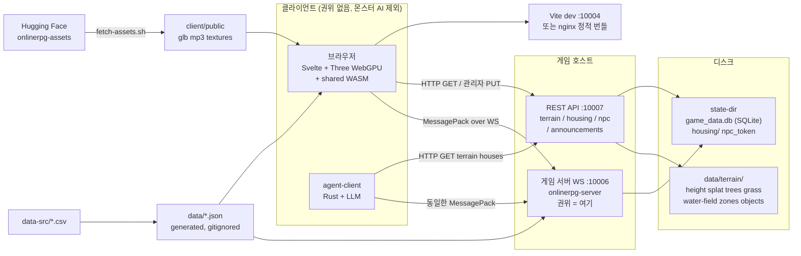
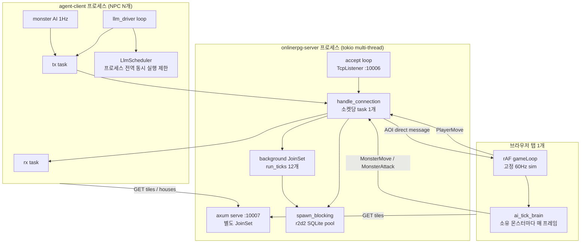
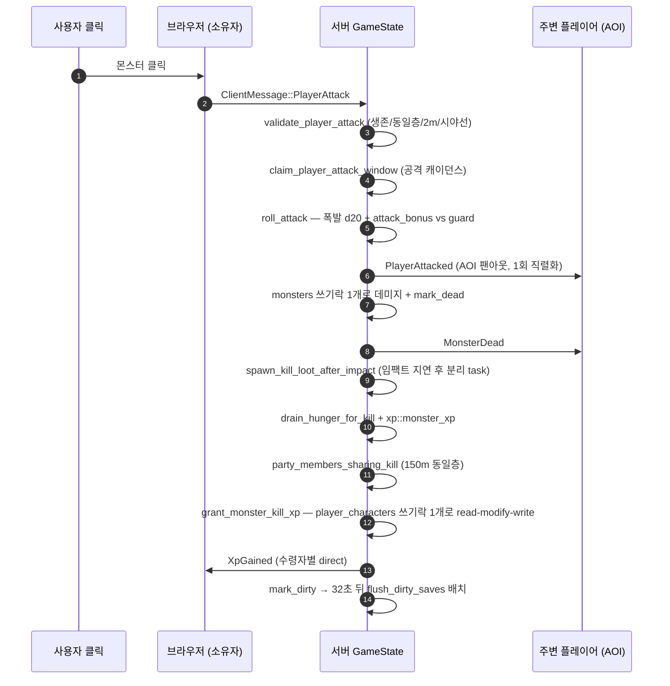
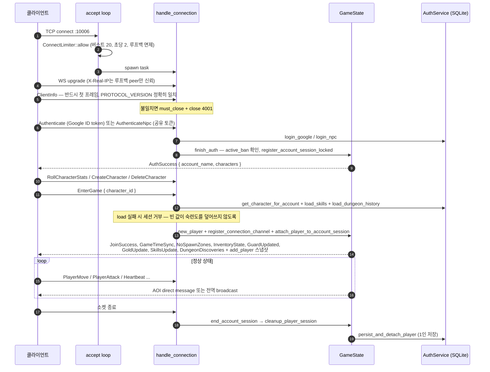
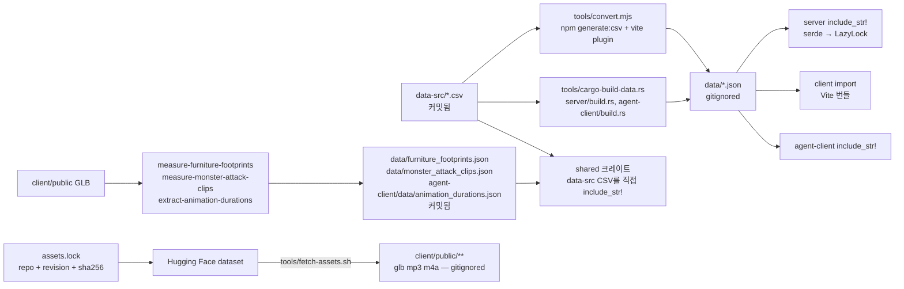
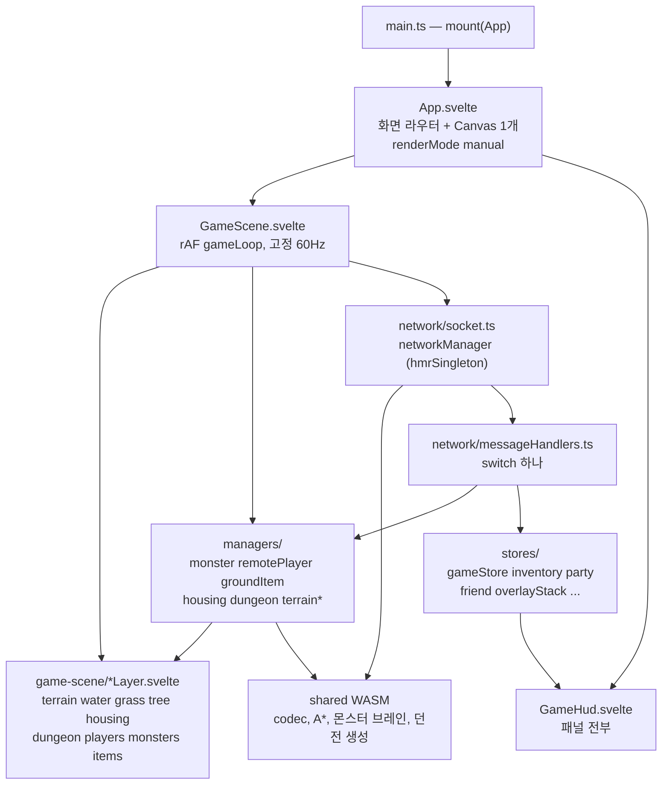

# OpenMMO 상세 구성도

현재 돌아가는 시스템의 구조 지도. 무엇을 어디서 고쳐야 하는지 찾는 용도.
개별 게임 시스템의 규칙은 [COMBAT.md](COMBAT.md), [HUNGER.md](HUNGER.md),
[FISHING.md](FISHING.md), [ragnarok/11_SYSTEMS_INDEX.md](ragnarok/11_SYSTEMS_INDEX.md)에 있고,
작업 절차는 [DEVELOPMENT.md](DEVELOPMENT.md)에 있다.

두 개의 하드 제약이 모든 설계 판단을 지배한다.

| 제약 | 의미 |
|------|------|
| 동시 5,000명 | 전역 브로드캐스트 금지, 배치 저장, 몬스터 AI 클라 위임 (CLAUDE.md) |
| 에이전트–사람 동등성 | 에이전트 전용 API·필드·권한이 존재하지 않는다. 서버는 상대가 봇인지 알 수 없다 ([REMOTE_AGENT_CLIENT.md](REMOTE_AGENT_CLIENT.md)) |

---

## 1. 한 장 요약



포트 정리 (`doc/DEVELOPMENT.md:136`, `client/vite.config.ts`, `server/src/main.rs:592`):

| 포트 | 서비스 | 기본 바인드 |
|------|--------|-------------|
| 10004 | 클라이언트 Vite dev 서버 | `host: true` (`client/vite.config.ts`) |
| 10005 | GLB 에디터 (`tools/glb-editor`, `vite dev --port 10005`) | 로컬 도구 |
| 10006 | 게임 WebSocket | `127.0.0.1` (`--bind`) |
| 10007 | REST API (`--terrain-port`, 기본 game port+1) | `127.0.0.1` (`--api-bind`) |

10006/10007은 기본이 루프백이다. 외부 노출은 항상 nginx/Vite 프록시를 거친다
(`docker/nginx.conf.template`이 `/api → 10007`, `/ws → 10006`으로 dev 설정을 그대로 미러링한다).

---

## 2. 크레이트 / 디렉터리 구성

Cargo 워크스페이스 멤버는 5개다 (`Cargo.toml`).

| 멤버 | 경로 | 책임 | 의존하는 쪽 |
|------|------|------|-------------|
| `onlinerpg-shared` | `shared/` | 와이어 프로토콜, 결정론적 룰(던전 생성, A*, 몬스터 행동트리, worldgen), 진행도 수식. `cdylib`+`rlib` → WASM으로도 빌드 | server, agent-client, terrain, terrain-gen, 브라우저(WASM) |
| `onlinerpg-server` | `server/` | 게임 서버 바이너리. WS 접속 수명주기, `GameState`, SQLite, REST 라우터 | (최종 산출물) |
| `agent-client` | `agent-client/` | LLM 조종 NPC 클라이언트 바이너리. 브라우저와 동일 프로토콜 | (최종 산출물) |
| `onlinerpg-terrain` | `terrain/` | 좌표 변환·경로 빌더(`coords.rs`), 타일 I/O(`io.rs`), 높이/수면 샘플러 + 타일 캐시 | server, terrain-gen, agent-client |
| `terrain-gen` | `tools/terrain-gen/` | 오프라인 월드 베이크 CLI (`bake`, `preview`, `apply-houses` 등) | (도구) |

Rust가 아닌 최상위 디렉터리:

| 디렉터리 | 책임 | 비고 |
|----------|------|------|
| `client/` | Svelte 5 + Threlte/Three WebGPU 브라우저 클라이언트 | `client/src/lib/wasm/`은 `wasm-pack` 산출물, gitignore |
| `data-src/` | 손으로 쓰는 게임 데이터 원본 (`*.csv`, `world.json`, `behavior_trees.json`) | 커밋됨 |
| `data/` | 생성 데이터 + 런타임 상태 (terrain, housing, SQLite, announcements) | 대부분 gitignore |
| `tools/` | 변환기, 측정기, 에셋 동기화, systemd 유닛, 배포 스크립트 | |
| `docker/` | Dockerfile 3종 + nginx 템플릿 + 엔트리포인트 | `docker-compose.yml`이 조합 |
| `doc/` | 설계 문서 (한국어) | 이 문서 포함 |

---

## 3. 런타임 토폴로지



### 서버 tick 루프 (전부 `server/src/main.rs:422-590`, `run_ticks`로만 생성)

| tick | 주기 | 하는 일 |
|------|------|---------|
| player movement | 200 ms (5 Hz) | `tick_player_movement` — 웨이포인트 큐 소화 + 충돌 |
| fishing | 250 ms | 캐스팅/입질/만료 타이머 |
| hunger | 250 ms | 그릴 매 tick, 4틱마다 캠프파이어·디버프·음식 재생 |
| party vitals | 1 s | 파티 HP 푸시 |
| party positions | 3 s | 파티 위치 푸시 |
| time sync | 8 s | 2틱마다 재생(16 s), **4틱마다 `flush_dirty_saves`(32 s)**, 게임시간 브로드캐스트 + 월드시계 저장 |
| monster spawn | 10 s | 플레이어별 앰비언트 몬스터 예산 계산 → `SpawnMonsterRequest` |
| dungeon refill | 30 s | 점유 중인 층의 스폰 슬롯 리필 |
| ground item despawn | 30 s | 바닥 아이템 만료 |
| monster ownership reconcile | 60 s | 이벤트 기반 소유권 이양의 **안전망** |
| terrain cache sweep | `TILE_CACHE_SWEEP_PERIOD` = 300 s | 유휴 타일 evict |
| buyback expiry | `BUYBACK_SWEEP_PERIOD` = 3600 s | 되사기 목록 정리 |

`run_ticks`(`main.rs:84`)를 거치지 않고 `tokio::spawn`한 루프는 shutdown watch를 못 보므로
드레인이 영원히 멈춘다. `guard_tick`(`main.rs:71`)이 한 회차의 패닉만 잡아 로그로 흘린다.

### 루프백 전용

- `--bind` / `--api-bind` 기본값이 `127.0.0.1` (`server/src/main.rs:172` `Args`).
- `X-Real-IP`는 **TCP peer가 루프백일 때만** 신뢰한다 (`server/src/conn_limit.rs:36` `resolve_client_ip`).
  nginx가 이 헤더를 `$remote_addr`로 덮어쓰기 때문. 루프백 자체는 레이트리밋 대상에서 제외 —
  안 그러면 nginx 뒤의 전체 플레이어가 버킷 하나를 공유한다.
- agent-client watch 패널도 `127.0.0.1` 바인드 + Host 헤더 가드 (`agent-client/src/watch.rs`).
- CORS 레이어가 없다. 브라우저는 항상 same-origin 프록시로만 REST에 닿는다.

---

## 4. 권위 모델 (Authority)

| 결정 주체 | 결정하는 것 |
|-----------|-------------|
| **서버** | 위치(이동 시뮬), 충돌, 전투 판정과 데미지, 사망, 루팅, XP/레벨, 골드, 인벤토리, 가드 값, 허기/디버프, 파티/친구, 상점 거래, 던전 층 입장, 몬스터 스폰 허가, 문/소품 상태, 게임 시계, 밴/뮤트 |
| **소유 클라이언트** | 자기 소유 몬스터의 **AI 결정**뿐 — 어디로 갈지, 언제 때릴지, 앰비언트 스폰 위치 후보 |
| **모든 클라이언트** | 렌더링, 보간, 애니메이션, UI. 서버가 보낸 것만 그린다 |

클라이언트 예측이 없다. 인벤토리·골드·가드·허기·XP·파티는 전부 서버 푸시로 통째 교체된다
(`setInventory`는 `PlayerInventory`를 항상 통째로 갈아끼운다, `client/src/lib/stores/inventoryStore.ts:38`).

### 몬스터 소유권

| 규칙 | 근거 |
|------|------|
| 소유자만 브레인을 돌린다. `ownerId === myPlayerId`일 때만 `ai_create_brain` | `client/src/lib/managers/monsterManager.ts:288` |
| 서버 팬아웃은 소유자를 제외한다. 소유자에게 도착한 위치 갱신은 곧 **교정**이므로 `ai_apply_authoritative_position`으로 브레인에 밀어넣어야 한다 | `monsterManager.ts:791` |
| 소유자 보고 이동은 검증된다: 유한값, Dead 아님, 소유권, 지면 Y ±0.25 m, 이동 토큰버킷(cap 12 m), 통행 가능성 스윕 | `server/src/game_state/monster.rs:435` `update_monster_position` |
| `MonsterState::Dead`는 서버 전투만 설정한다. 클라가 보고한 Dead는 malformed 입력 취급 | 동일 |
| 소유자가 AOI 밖으로 나가면 이양(least-loaded → 최근접), 입양자가 없으면 `Ambient`는 despawn / `DungeonSlot`은 주차 | `monster.rs:785` `release_monsters_left_behind`, `shared/src/entity.rs:158` |
| 접속 종료 시 `ids_owned_by`로 O(1) 정리 | `monster.rs:751` |

### 스폰 상한

| 상한 | 값 | 위치 |
|------|-----|------|
| 플레이어당 앰비언트 몬스터 | `maxMonstersPerPlayer` = **30** | `data-src/world.json:8`, 기본값 `server/src/world_config.rs:26` |
| 전역 몬스터 상한 | **없음** — 30 × 접속자 수가 곧 상한 | `world_config.rs:21` 주석이 명시 |
| 스폰 허용권 TTL | `AMBIENT_SPAWN_ALLOWANCE_TTL_MS` 30 s, 1회용 | `game_state/monster.rs:27` |
| 노스폰 존 마진 | `NO_SPAWN_MARGIN` 30 m | `game_state/monster.rs:8` |

### 몬스터 처치 한 번의 흐름



데미지 적용과 사망 선언이 같은 `monsters` 쓰기 가드 안에서 일어난다
(`server/src/game_state/combat.rs:411-434`). 동시에 들어온 두 번째 공격자는 Dead를 보고 리턴하므로
킬 크레딧이 두 번 나가지 않는다.

---

## 5. 접속 수명주기



핵심 함수: `server/src/connection.rs:283` `handle_connection`, `:733` `handle_client_message`,
`:678` `handle_handshake`, `:568` `finish_auth`, `:948` EnterGame 처리,
`server/src/game_state/player.rs:481` `cleanup_player_session`.

메인 루프는 `connection.rs:367`의 biased `select!`로 6개 소스를 본다:
shutdown / 계정 킥 채널 / 10 s 하트비트 타이머 / 인바운드 프레임 / 전역 broadcast / 플레이어 direct mpsc.

타임아웃: 미인증 60 s (`UNAUTH_TIMEOUT_SECS`, close 4003), 인게임 하트비트 30 s.
미인증 소켓은 8 KiB·30메시지 상한을 넘으면 끊기고, 전역 broadcast를 아예 받지 않는다
(`connection.rs:504` — 정보 유출 방지).

**셧다운은 순서가 정해져 있다** (`main.rs`): 공지 브로드캐스트 → accept 중단 → tick+REST 정지 →
2 s 유예 → 커넥션 닫기(개별 저장 **생략**) → `persist_shutdown_snapshot`으로 접속자 전원을
**트랜잭션 하나**에 기록. 5,000명 로그아웃이 5,000 커밋이 되지 않도록 만든 경로다
(`game_state/player.rs:577`).

---

## 6. 프로토콜 지도

| 항목 | 값 |
|------|-----|
| 포맷 | MessagePack (`rmp_serde`), 구조체는 **위치 기반 배열**로 인코딩 |
| 정의 | `shared/src/messages.rs` — `ClientMessage` **66** variant, `ServerMessage` **101** variant |
| 버전 | `PROTOCOL_VERSION = 29` (`shared/src/lib.rs:78`), 서버가 **정확히 일치**만 허용 |
| 코덱 | `serialize_client_msg` / `deserialize_client_msg` / `serialize_server_msg` / `deserialize_server_msg` (`messages.rs:1206-1221`) — 와이어 포맷 이름이 등장하는 유일한 곳 |
| 브라우저 경로 | 같은 함수를 WASM으로 (`shared/src/wasm_api.rs:33`, `:40`) |
| agent-client 경로 | 같은 함수를 네이티브로 (`agent-client/src/ws.rs:141`, `:156`) |
| close code | 4001 프로토콜 불일치 / 4002 레이트리밋 / 4003 유휴 (`lib.rs:85-97`) |

기능 그룹 (variant 접두어 기준): 핸드셰이크·인증·캐릭터, 이동·AOI, 전투, 몬스터 소유권,
인벤토리·장비·인챈트, 상점·거래·되사기, 파티, 친구·귓속말, 채팅·이모트·음악,
낚시, 허기·디버프·캠프파이어, 던전(층·문·소품·상자), 하우징, 노점·팁햇, 시간·공지, Debug*(관리자).

### 메시지 하나가 건드리는 파일

새 메시지는 **최소 3곳**을 반드시 건드린다. `.claude/skills/add-protocol-message`가 전체 스윕을 다룬다.

| # | 파일 | 하는 일 |
|---|------|---------|
| 1 | `shared/src/messages.rs` | variant를 **append** (삽입 금지 — 위치가 곧 계약) + `PROTOCOL_VERSION` 증가 및 체인지로그 한 줄 |
| 2 | `server/src/connection.rs` | `handle_client_message`의 match arm. exhaustive라 컴파일러가 강제한다 |
| 3 | `client/src/lib/network/messageHandlers.ts` | `handleServerMessage` switch의 `case '<Variant>':` — **문자열 매칭이라 빠뜨려도 조용히 무시된다** |

부수적으로: 클라 송신은 `client/src/lib/network/socket.ts`의 `sendXxx` + `networkTypes.ts`의 유니온,
NPC가 써야 하면 `agent-client/src/main.rs:391` `msg_name`(와일드카드 없는 exhaustive match라
**컴파일이 깨져서** 알려준다) + `driver/prompt.rs:164` `format_event` + `state/events.rs:21` `classify_event`.

### 절대 규칙

- `skip_serializing_if` 금지. 위치 배열이라 중간 필드가 빠지면 이후 전부 밀린다
  (`shared/src/entity.rs:71`, `:190`에 경고와 회귀 테스트가 붙어 있다).
- `PlayerId`를 map 키로 쓰지 말 것. `to_js`의 `serialize_maps_as_objects(true)`가 비문자열 키를
  거부하고 클라가 프레임 전체를 조용히 버린다. `GameState`가 `Vec<Player>`인 이유.
- 새 메시지는 가능한 좁은 청중에게. 전역 broadcast는 게임시간·서버공지 같은 진짜 월드 전역 사실만.

---

## 7. 상태 소유권 표

`GameState`(`server/src/game_state/mod.rs:317`)는 필드마다 독립적인 `Arc<RwLock<_>>`을 가진다.
월드 락 하나가 아니라 작은 락 다수 — 이게 5,000명을 버티는 1차 구조다.

| 상태 | 소유 | 락 | 영속화 | 전파 범위 |
|------|------|-----|--------|-----------|
| 플레이어 명부/포즈/HP | `GameState.players` | `RwLock<HashMap<PlayerId, Player>>` | `characters` 테이블 (dirty 배치) | AOI 43 m + 동일 층 |
| 이름→id 색인 | `player_ids_by_name` | 자체 `RwLock` | — | 내부 전용 (조회 후 재검증) |
| 이동 의도 큐 | `movement_intents` | `RwLock` | 없음 | — |
| 공간 해시 | `player_spatial_cells` | `RwLock<SpatialIndex>` | 없음 | — |
| 몬스터 + 소유자/셀 색인 | `monsters: MonsterRegistry` | `RwLock` | 없음 (재시작 시 소멸) | AOI |
| 캐릭터 XP/능력치 | `player_characters` | `RwLock` | `characters` (dirty 배치) | 본인 (`XpGained`) |
| 골드 | `player_gold` | `RwLock` | `characters` | 본인 (`GoldUpdate`) |
| 인벤토리/장비 | `inventories` | `RwLock` | 인벤토리 테이블 (replace) | 본인 통째 스냅샷 |
| 숙련도 | `player_skills` | `RwLock` | upsert (delete+insert 아님, `auth.rs:346`) | 본인 |
| 허기/디버프 | `hunger` | `RwLock<HashMap<PlayerId, HungerData>>` | satiation만 `characters` | 본인. **엔트리 부재 = 공식 NPC 면제** |
| 바닥 아이템 | `ground_items` | `RwLock` | 없음 (30분 수명) | AOI |
| 파티 | `parties` | `RwLock<Parties>` | 없음 — 접속 종료 = 탈퇴 | 파티원 (AOI 예외, ≤5명) |
| 친구/차단 | `friends`, `blocked_names` | `RwLock` | DB | 본인 (푸시 없음, 클라 폴링) |
| 던전 런타임 | `dungeons` | `RwLock<DungeonRuntime>` | **보물상자 청구만** DB | 층 점유자 |
| 던전 발견 기록 | `dungeon_discoveries` | `RwLock` | DB (dirty 배치) | 본인 |
| 캠프파이어/노점/팁햇 | 각자 `RwLock` | | 없음 | AOI |
| 상점 홀드/되사기 | `open_shops`, `buybacks` | `RwLock` | 없음 (24 h TTL) | 당사자 |
| 계정 세션 | `account_sessions` | `character_session_lock` | 없음 | — |
| 통행 가능성 | `PassabilityCache` | **`std::sync::RwLock`** (동기) | 파생 (집/가구/던전에서 재구축) | — |
| 월드 시계 | `GameState` 시간 필드 | | DB, 8 s tick마다 | **전역 broadcast** |
| 서버 공지 | | | 없음 | **전역 broadcast** |

영속화는 이벤트마다가 아니라 dirty-set 배치다: `flush_dirty_saves`(32 s, `player.rs:644`)와
`persist_shutdown_snapshot`(드레인 시, `player.rs:577`) 둘 다 `AuthService::save_batch`(`auth.rs:1266`)로
모여 SQLite 트랜잭션 하나가 된다. 배치가 실패하면 뽑아낸 dirty id를 전부 되돌려 표시한다 —
안 그러면 그 변경은 다음 무관한 변경 때까지 사라진다.

락 순서: `player_characters` / `hunger` **먼저**, `player_gold` / `inventories` **나중**
(`game_state/inventory.rs:234` 주석에 명시).

---

## 8. 데이터 파이프라인



변환기가 **두 벌** 있고 출력이 바이트 단위로 같아야 한다. `cargo-build-data.rs:106`의
`stringify_entries`가 `JSON.stringify(x, null, 2) + '\n'`을 손으로 흉내내는 이유다.
한쪽만 고치면 `cargo build`와 `npm run generate:csv`가 같은 파일을 두고 싸운다.

| 차이 | JS (`convert.mjs`) | Rust (`cargo-build-data.rs`) |
|------|--------------------|------------------------------|
| 필드 수 불일치 | 짧은 행 허용, 남는 필드 조용히 버림 | **에러 → 빌드 실패** (`:59`) |
| `id` 없음 | `"undefined"` 키 생성 | **에러** (`:84`) |

즉 Rust 쪽이 실질 게이트다. CSV 인용부호·이스케이프·대체 구분자는 지원하지 않는다 (단순 `split(',')`).
값에 콤마를 넣으면 이후 컬럼이 전부 밀린다.

`shared`는 **`data/*.json`이 아니라 `data-src` CSV를 직접 읽는다** —
build script 실행 순서가 보장되지 않기 때문 (`shared/src/dungeon/registry.rs:74`,
`shared/src/dungeon/mod.rs:499`).

### gitignore 상태

| 산출물 | 추적 여부 |
|--------|-----------|
| `data-src/**` | 커밋 |
| `data/{bgm,debuffs,dungeons,items,map_labels,merchants,monsters,npcs,player_anim_timing,world_drop}.json` | **gitignore** (재생성) |
| `data/furniture_footprints.json`, `data/monster_attack_clips.json`, `agent-client/data/animation_durations.json` | **커밋** (GLB 없는 체크아웃에서도 빌드되도록) |
| `data/terrain/`, `data/housing/`, `data/*.db`, `data/npc_token` | **gitignore** (런타임 상태) |
| `*.glb *.mp3 *.m4a *.blend`, `/assets/` | **gitignore** — `assets.lock`이 sha256로 핀 |
| `client/src/lib/wasm/` | **gitignore** (`wasm-pack` 산출물) |
| `agent-client/data/config.toml`, `npcs/**/memory.txt`, `favor.json` | **gitignore** (배포/런타임 상태) |

`npm run build:wasm`이 전체를 순서대로 돌린다:
`generate:csv → generate:footprints → generate:monster-clips → generate:animations →
rm -rf src/lib/wasm → wasm-pack build shared` (`client/package.json`).
GLB 측정기는 mtime으로 자기 스킵하므로(`tools/lib/stale.mjs`) 평소 경로에서 GLB를 읽지 않는다.

---

## 9. 월드 데이터 구성

### 좌표 상수

| 단위 | 값 | 근거 |
|------|-----|------|
| 기본 단위 | 미터 | |
| 타일 | 64 m, 높이 65×65 u16 정점 / 스플랫 64×64×4 셀 | `terrain/src/defaults.rs:1` (`TILE_DIM`, `VERTS_PER_SIDE`, `HEIGHTMAP_SIZE` 8450 B, `SPLATMAP_SIZE` 16384 B) |
| 타일 범위 | 타일 t = `[t*64-32, t*64+32)` — **월드 원점이 타일 중심** | `terrain/src/coords.rs:30` `world_to_tile` |
| 리전 | 16×16 타일 = 1024 m, 디렉터리명 `r{:+03}_{:+03}` | `coords.rs:24` |
| X 순환 | 512 타일 / 32 리전 / 32,768 m, 서쪽 끝 −16,416 | `coords.rs:6`, `shared/src/world.rs:9` |
| Z | 순환 없음 | |
| 높이 코덱 | `m = v*0.05 - 500.0`, 10000 = 해수면 | `terrain/src/height.rs:12` |
| AOI 반경 | `EVENT_DELIVERY_RADIUS = 43.0` (= 공간 해시 셀 크기) | `shared/src/world.rs:134` |
| NPC 시야 | `NPC_SIGHT_RADIUS = 27.0`, 컴파일 타임에 AOI ≥ 시야 assert | `world.rs:128`, `:137` |

모든 경로 빌더가 타일/리전 X를 wrap하므로 범위 밖 X를 요청해도 반대편 파일이 나온다.

### `data/terrain/` 레이아웃 (전부 `terrain/src/coords.rs`가 정의)

| 경로 | 내용 | 쓰는 주체 |
|------|------|-----------|
| `height/r±NN_±NN/h_±NNNNN_±NNNNN.bin` | 65² u16 높이 | terrain-gen bake, 맵 에디터 PUT |
| `height-original/.../o_*.bin` | 하우징 평탄화 이전 스냅샷 | `apply-houses`, 맵 에디터 ensure |
| `splat/.../s_*.bin` | 64²×4 텍스처 가중치 | bake, 맵 에디터 |
| `trees/.../t_*.bin` | `TR01` — 12 B 헤더 + 6 B/인스턴스 | bake, 집 신축 시 서버가 벌목 |
| `grass/.../g_*.bin`, `grass-original/` | `GR03` — 16 B 헤더 + 6 B/인스턴스 | bake, 잔디 카빙 PUT |
| `water-field/.../wf_*.bin` | `WFD1` — 16 B 헤더 + 65²×6 B = 25,366 B | bake (`--water-field-only`로 라이브 안전 갱신 가능) |
| `river-field/.../rf_*.bin` | `RFD1` — 구버전 클라용 4 B/픽셀 | bake |
| `minimap/r±NN_±NN.png` | 리전 미니맵 | bake |
| `zones/r±NN_±NN.json` | `noSpawnZones` 등 | **맵 에디터 REST PUT만** |
| `objects/r±NN_±NN.json` | 가구/소품 배치 | 맵 에디터 PUT + bake가 다리(bridge) 항목만 소유 |
| `worldgen.json` | 베이크 파라미터/시드 | bake |

높이/스플랫 타일이 없으면 기본값(평평한 바다 / 팔레트 0번)으로 해석한다 —
월드가 베이크 범위보다 크기 때문에 의도된 동작이다.

### 존 / 하우징 / 던전

| | 저장 위치 | 특징 |
|---|-----------|------|
| **존** | `data/terrain/zones/r±NN_±NN.json` | 서버는 `noSpawnZones`만 부팅 시 읽는다 (`server/src/world_config.rs:93`). 실패하면 부팅 중단(fail-closed). **핫 리로드 없음** — 재시작 필요. 같은 파일의 `monsterSpawns`는 레거시로, 서버가 읽지 않는다 ([ZONE_SYSTEM.md](ZONE_SYSTEM.md)의 해당 서술은 낡았다) |
| **하우징** | `{--state-dir}/housing/r{cx}_{cz}/{house_id}.json` | 하우징 청크는 **64 m, `floor(x/64)`** — 지형 타일(`floor((x+32)/64)`)도 1024 m 리전도 아니다. 디렉터리 이름만 같은 꼴. 통행 격자는 **클라이언트가 계산**해 보내고(`client/src/lib/managers/housing-passability.ts:38`) 서버는 그대로 들어올린다 |
| **던전** | 저장하지도 전송하지도 않는다 | `data-src/dungeons.csv` 한 줄 → id를 FNV-1a로 해싱 → ChaCha8 시드 → 서버와 WASM 클라가 각자 동일 레이아웃 생성. 와이어에는 엔티티/문/소품 델타만 흐른다 |

세 시스템 모두 하나의 `PassabilityCache`에 층 인덱스로 들어간다.
하우징 0..=3 (`housing::MAX_FLOOR_LEVEL`), 던전 깊이 d → `DUNGEON_FLOOR_INDEX_BASE + d - 1` (= 4부터).
층 인덱스가 겹치면 던전 벽이 지상의 플레이어를 막는다 (차단 판정이 층 인덱스만 본다).

자세한 내용은 [TERRAIN_GENERATION.md](TERRAIN_GENERATION.md), [WATER_SYSTEM.md](WATER_SYSTEM.md),
[HOUSING_SYSTEM.md](HOUSING_SYSTEM.md), [MAP_DESIGN.md](MAP_DESIGN.md).

---

## 10. 클라이언트 구성



### 프레임 파이프라인

캔버스는 `renderMode="manual"`이다. `invalidate()`를 부르는 게 없으면 아무것도 안 그린다.
인게임에서는 오직 `gameLoop` 끝의 `renderCadence.shouldRender()`만 그것을 호출한다.
`autoInvalidate`가 켜진 `useTask`를 추가하면 프레임 상한이 조용히 무력화된다.

시뮬레이션은 화면 주사율과 무관하게 **고정 60 Hz**(최대 5스텝 캐치업), 렌더는 그래픽 프리셋의
`maxRenderFps`로 별도 제한.

한 프레임 순서 (`client/src/lib/components/GameScene.svelte:470`):
FPS/달력/태양 → 카메라 오프셋 → `playerControl.updatePlayerControl` →
`tileManager.updateFromPlayerPosition` + `drainTileWork`(기본 4 ms 예산) →
`remotePlayerManager.update` → 플레이어 모델들 → **`monsterManager.update`(소유 몬스터마다 `ai_tick_brain`)** →
하우징/던전/나무/바닥아이템/잔디/바람 레이어 → 조명·물 유니폼 →
`runRenderPasses`(젖음 프리패스 + 짝수 프레임 굴절 / 홀수 프레임 반사) → `invalidate()`.

엔티티는 `group.position`을 **명령형으로** 직접 쓴다. 위치가 변경되는 plain object / `Vector3`라
Svelte 반응성이 추적하지 못하고, 굴절 패스가 Svelte 플러시보다 먼저 돌기 때문이다.

### 캐시

| 캐시 | 정책 |
|------|------|
| `gltfCache`, `iconTextureCache`, `TextLabel` 텍스처 | **의도적으로 절대 dispose 안 함** (공유 텍스처, `TextLabel.svelte:196`에 three.js WebGPU 크래시 사유가 적혀 있다) |
| 지형 머티리얼/지오메트리 풀 | 사전 시드 + `compileAsync`. 신규 TSL 머티리얼 1개 = WGSL·파이프라인 컴파일 100~1000 ms |
| `TerrainHeight/Splat/GrassData/TreeData` 매니저 | tile당 fetch 1회 + inflight 중복 제거. **`evictCachedData`/`evictExcept`에 호출부가 없다** — 세션 내내 누적 |
| `RegionImageCache` | bake 버전 플러시 + 10 s→300 s 지수 백오프. 기본 `maxImages = Infinity`, 소비자 두 곳만 상한을 건다 |
| 씬 리소스 | `GameScene.svelte`의 `onMount` 정리에서 파기 |

지상/지하 전환은 언마운트가 아니라 `visible = false` 토글이다 (파이프라인 재컴파일 회피).
다른 층 몬스터·아이템도 `OFFSCREEN_Y`에 주차한다.

Web Worker는 **하나도 없다**. 높이/스플랫 디코드, 지오메트리 재빌드, WASM A*, 몬스터 브레인이
전부 메인 스레드 16.6 ms 예산 안에서 돈다.

---

## 11. 에이전트 클라이언트 구성

`agent-client`는 브라우저와 **같은 WebSocket, 같은 MessagePack, 같은 `ClientMessage` enum**으로
붙는 헤드리스 Rust 클라이언트다. 프로세스 하나가 `data/config.toml`의 `[[npcs]]` 블록마다
독립 세션을 띄운다.

```
main.rs → SharedResources (지형 샘플러, WorldCache(던전 전부 사전생성),
                            행동트리, LlmScheduler, AuthSource, watch 허브)
        → orchestrator::run_orchestrator → NPC당 tokio task
             └ run_npc_session: connect → ClientInfo → 인증 → 캐릭터 확보 → EnterGame
                  ├ tx task    (mpsc → ws::send)
                  ├ rx task    (ws::recv → SharedState::push_event)
                  ├ AI tick    (1 Hz, MonsterAssigned된 몬스터만)
                  └ llm_driver (프롬프트 조립 → LlmScheduler → JSON 응답 → 액션 실행)
```

| 레이어 | 담당 |
|--------|------|
| LLM | 전략만. `{"type": ...}` JSON 액션 배열 + memory/favor 갱신 |
| 클라이언트 | 실행. 이름→PlayerId 해석, A* 이동, 문 열기, 추격, 층 이동, 결과 판정(`settle_action`) |
| 서버 | 시뮬레이션. 다른 클라이언트와 완전히 동일하게 검증한다 |

LLM 백엔드 4종(Claude CLI, Codex CLI, OpenRouter, OpenAI 호환)이 `LlmBackend` 트레이트 하나 뒤에 있고,
전부 `TimeoutBackend`로 감싸 프로세스 전역 `LlmScheduler`(우선순위 큐 + `max_concurrent`)를 통과한다.
NPC를 늘리면 소켓/CPU는 선형으로 늘지만 LLM 동시 호출 수는 늘지 않는다.

액션 어휘는 `agent-client/src/driver/action.rs:322`의 `ACTION_SPECS` 한 표에서 나온다.
이 표가 `data/system_prompt.txt`의 `{{ACTIONS}}` 자리에 렌더되고, 테스트가 표와 `AgentAction`
enum의 variant 집합이 정확히 같은지, 문서의 모든 예제 JSON이 실제 파서를 통과하는지 검증한다.

### 동등성 제약 (구조적으로 보장됨)

- JSON 엔드포인트 없음, 에이전트 전용 variant 없음, 서버에 클라 종류 분기 없음.
- `client_kind`는 `#[serde(skip)]`이고 자기 신고값이며 `/who` 집계에만 쓴다 (`shared/src/entity.rs:94`).
- `EVENT_DELIVERY_RADIUS >= NPC_SIGHT_RADIUS`가 컴파일 타임 assert — 에이전트가 인지하는 것은
  반드시 전달받는다.
- `auth mode = "google"`이면 레지스트리 NPC 사칭 금지, 운영자 전용 클래스(merchant/guard) 금지,
  자기가 만들지 않은 캐릭터 삭제 금지 (`agent-client/src/main.rs:294`).

자세한 설계 근거는 [AGENT_CLIENT.md](AGENT_CLIENT.md), 원격 사용자 트랙은
[REMOTE_AGENT_CLIENT.md](REMOTE_AGENT_CLIENT.md).

---

## 12. 배포 구성

### 프로덕션 (systemd + nginx)

`tools/deploy-prod.sh`를 **배포 호스트 위에서** 실행한다. 순서:

```
git pull --ff-only
tools/fetch-assets.sh                     # assets.lock 기준 바이너리 에셋
cargo build --release -p onlinerpg-server
cargo build --release -p agent-client
(cd client && npm ci && npm run build)    # build:wasm 포함 → 번들에 항상 최신 wasm
rsync -a --delete client/dist/ /var/www/openmmo/
systemctl restart openmmo-server
systemctl restart openmmo-agent-client    # 유닛이 있을 때만
```

정적 번들 교체와 서버 재시작을 **한 묶음**으로 한다. 브라우저가 받는 wasm과 돌아가는 서버가
프로토콜 버전에서 어긋나면 안 되기 때문 (버전 불일치는 close 4001).

| 유닛 | 바이너리 | WorkingDirectory | 로그 |
|------|----------|------------------|------|
| `openmmo-server.service` | `target/release/onlinerpg-server` | `/home/ubuntu/work/OnlineRPG` (data/, data/terrain/, data/npc_token을 CWD 기준으로 찾는다) | journald, `SyslogIdentifier=openmmo` |
| `openmmo-agent-client.service` | `target/release/agent-client` | `.../OnlineRPG/agent-client` (config는 `data/config.toml`, 토큰은 `../data/npc_token`) | journald, `SyslogIdentifier=openmmo-agent` |

둘 다 `Restart=always`, `StartLimitIntervalSec=0`(배포 실패로 크래시루프해도 포기하지 않음),
`NoNewPrivileges` / `PrivateTmp` / `ProtectSystem=full` 등의 하드닝이 걸려 있다.
비밀값은 유닛에 없고 선택적 `EnvironmentFile`(`/etc/openmmo/server.env`,
`/etc/openmmo/agent-client.env`)에서 읽는다 — 리포에 없는 게 정상이다.

agent-client 유닛은 서버에 `Requires=`를 걸지 않는다(`After=`만). NPC가 스스로 재접속하므로
서버 재시작이 세션을 끊어선 안 되기 때문이다.

로그 확인: `journalctl -u openmmo-server -f`, `journalctl -u openmmo-agent-client -f`.
유닛 이름은 `openmmo-server`이고 `openmmo`는 `SyslogIdentifier`다 — `-u openmmo`는 아무것도
출력하지 않는다. 식별자로 고르려면 `journalctl -t openmmo -f`.
레벨은 `RUST_LOG`(기본 `info`, `server/src/main.rs:285`).

REST API 태스크가 죽으면 서버는 드레인 후 **0이 아닌 코드로 종료**한다 (`main.rs:662`).
systemd `Restart`가 잡아낼 수 있게 하려는 의도 — 부분 장애는 systemd가 볼 수 없다.

### nginx

`docker/nginx.conf.template`이 그대로 참고본이다.

| location | 대상 | 비고 |
|----------|------|------|
| `/api/` | `:10007` | `X-Real-IP`, `X-Forwarded-For`, `client_max_body_size 32m` |
| `/ws` | `:10006` | Upgrade 헤더, `proxy_read_timeout 3600s` (유휴 플레이어를 끊지 않기 위해) |
| `/assets/` | 정적 | 해시 파일명 → `immutable`, 1년 |
| `*.glb/mp3/m4a/wasm/png/...` | 정적 | 30일 |
| `/index.html` | 정적 | **캐시 금지** (현재 에셋 해시를 담고 있음) |
| `/` | `try_files ... /index.html` | SPA 폴백 |

### Docker Compose

`docker-compose.yml`이 서비스 4개를 정의한다.

| 서비스 | 역할 |
|--------|------|
| `terrain-init` | 원샷. 빈 terrain 볼륨을 `docker/terrain-bake.sh`로 채우고 종료. 서버 이미지를 엔트리포인트만 바꿔 재사용(퍼블리시 이미지 3개 유지) |
| `server` | `--bind 0.0.0.0 --api-bind 0.0.0.0` (루프백 기본값이면 형제 컨테이너에서 못 닿는다). 헬스체크는 `/api/announcements` |
| `client` | nginx + 빌드된 번들. **유일하게 호스트로 퍼블리시되는 포트** (`CLIENT_PORT`, 기본 8080). 앞단 TLS 프록시는 운영자 몫 |
| `agent-client` | `--profile agent` 옵트인. 서버 state 볼륨을 **읽기 전용**으로 마운트해 `npc_token`을 얻는다 |

볼륨: `state`, `terrain`, `npcs`, `agent-cache`. 설정은 `.env`(`.env.example` 참고).

---

## 13. 성능 구조

### 5,000명을 지금 가능하게 하는 것

| 메커니즘 | 구현 |
|----------|------|
| **몬스터 AI를 클라에 위임** | 소유 클라가 행동트리를 돌리고 서버는 검증만. 몬스터 수가 늘어도 서버 CPU는 검증 비용만 진다 |
| **AOI 팬아웃 + 공간 해시** | 셀 크기 = `EVENT_DELIVERY_RADIUS` = 43 m. 질의당 ~9셀(X 이음매 근처 최대 ~18)만 훑는다. 명부 전체 스캔이 없다 |
| **1회 직렬화 후 `Bytes` 공유** | `send_direct_message_to_players_except`가 한 번 인코딩하고 수신자마다 `Bytes`만 clone. `direct_channels` 읽기 가드도 하나 |
| **전역 broadcast를 게임시간·공지로 제한** | 위치성 이벤트가 전역으로 나가면 5,000배 팬아웃 |
| **락 다수, 월드 락 없음** | `GameState` 필드마다 독립 `RwLock`. 몬스터 레지스트리는 소유자 색인 + 셀 색인 |
| **배치 저장** | 32 s dirty 플러시 1트랜잭션 + 종료 시 전원 1트랜잭션. 모든 SQLite는 `spawn_blocking` + r2d2 풀 |
| **5 Hz 이동 tick** | 200 ms마다 큐를 소화. 큐가 비면 즉시 리턴하고, 한 패스 동안 락 3개만 잡았다가 팬아웃 전에 푼다 |
| **소유자당 몬스터 상한** | 30, `OwnedIds::len_for`로 O(1) 조회 (스폰마다 확인하므로 중요) |
| **던전을 전송하지 않음** | 시드로 양쪽이 각자 생성. 접속당 최대 페이로드가 사라진다 |
| **루프백 바인드 + 프록시** | 게임/REST 포트가 외부에 직접 노출되지 않는다. REST GET은 전부 공개·무인증이라 CDN 캐시 가능 |
| **접속 전 자원 상한** | 미인증 60 s / 8 KiB / 30메시지, 전역 broadcast 미전달. WS 메시지·프레임 64 KiB(tungstenite 기본 64 MiB에서 축소), 읽기 버퍼 16 KiB |
| **IP 토큰버킷** | 버스트 20 / 초당 2, 추적 IP 100,000 상한 초과 시 fail-open |
| **클라 재접속 full jitter** | `capped/2 + rand*(capped/2)`, 최대 30 s. 서버 재시작이 5,000개의 동시 재접속 파도가 되지 않게 |

배경은 [RUNTIME_PERFORMANCE.md](RUNTIME_PERFORMANCE.md)에 더 있다.
(통행 가능성 공간 인덱스는 **검토 후 의도적으로 만들지 않았다** — 충돌 인덱스 작업을 제안하기 전에 읽을 것.)

### 알려진 압박 지점

| 지점 | 내용 |
|------|------|
| **전역 broadcast 채널 용량 1000** | `game_state/mod.rs:583`. 느린 구독자는 `Lagged(skipped)`로 경고만 받고 프레임이 조용히 유실된다. 5,000 구독자 × 1000 버스트 |
| **전역 몬스터 상한 없음** | 30 × 접속자 수가 그대로 상한. 5,000명이면 최대 150,000 몬스터. `world_config.rs:21` 주석이 느슨한 경계임을 명시 |
| **원격 플레이어 모델에 LOD·상한 없음** | 플레이어/몬스터는 인스턴싱되지 않는다. 각자 clone된 스킨드 메시 + 자기 `AnimationMixer` + 네임태그 텍스처. 같은 자리에 모이는 상황은 서버 AOI가 `otherPlayers`를 작게 유지해 주는 것에만 의존한다 |
| **클라 지형 캐시 무제한** | 4개 매니저의 evict 메서드에 호출부가 없다. 걸어 다니면 heightmap(~8.5 KB/타일) + splat 바이트(16 KB/타일) + GPU의 66² DataTexture가 세션 내내 누적 |
| **매 프레임 몬스터 객체 clone** | `monsterManager.update`가 몬스터마다 `monsters.set(id, {...monster})`. SvelteMap 쓰기가 `{#each}`를 무효화하고 그 안에서 다시 `[...monsters.values()]`를 편다 |
| **메인 스레드 단일화** | Web Worker 0개. 디코드·A*·브레인이 전부 프레임 예산 안 |
| **친구 프레즌스 폴링** | 푸시가 없다. 패널 열림 15 s / 닫힘 60 s 폴링 |
| **`objectManager` 리전 캐시** | evict 없음, `findNearestPlacement`가 캐시된 전 리전의 배치를 선형 스캔 |
| **월드 X 이음매 근처 AOI** | 셀 질의가 보수적 상위집합(반대편 복사본 포함)이라 최대 2배 셀을 훑는다 |

---

## 참고 문서

- 작업 절차·포트·CSV 규칙: [DEVELOPMENT.md](DEVELOPMENT.md)
- 런타임 최적화 이력과 시도했다 접은 것들: [RUNTIME_PERFORMANCE.md](RUNTIME_PERFORMANCE.md)
- 전투 수식: [COMBAT.md](COMBAT.md) / [ragnarok/02_STATS_COMBAT.md](ragnarok/02_STATS_COMBAT.md)
- 시스템 색인과 갭 분석: [ragnarok/11_SYSTEMS_INDEX.md](ragnarok/11_SYSTEMS_INDEX.md),
  [ragnarok/09_OPENMMO_GAP_ANALYSIS.md](ragnarok/09_OPENMMO_GAP_ANALYSIS.md)
- 항목별 구현 방향(손댈 파일·스키마·검증): [ragnarok/13_IMPLEMENTATION_DIRECTION.md](ragnarok/13_IMPLEMENTATION_DIRECTION.md)
- 착수 순서·게이트: [DEVELOPMENT_MASTER_PLAN.md](DEVELOPMENT_MASTER_PLAN.md)
- 월드/지형: [TERRAIN_GENERATION.md](TERRAIN_GENERATION.md), [WORLD_BUILDING.md](WORLD_BUILDING.md),
  [ZONE_SYSTEM.md](ZONE_SYSTEM.md), [HOUSING_SYSTEM.md](HOUSING_SYSTEM.md)
- 에이전트: [AGENT_CLIENT.md](AGENT_CLIENT.md), [REMOTE_AGENT_CLIENT.md](REMOTE_AGENT_CLIENT.md),
  [NPC_MONSTER_AI.md](NPC_MONSTER_AI.md)
