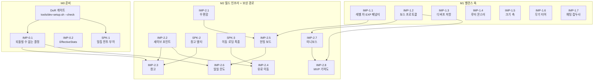
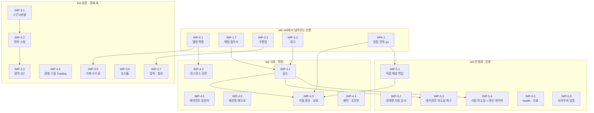

# 개발 마스터 플랜 (Development Master Plan)

[09_OPENMMO_GAP_ANALYSIS](ragnarok/09_OPENMMO_GAP_ANALYSIS.md)가 **무엇을**,
[10_IMPLEMENTATION_ROADMAP](ragnarok/10_IMPLEMENTATION_ROADMAP.md)가 **어떤 파일을**
정했다면, 이 문서는 **어떤 순서로**를 정한다.

---

## 0. 현재 진행 상황 (이어서 작업할 때 먼저 읽는다)

**브랜치**: `claude/project-analysis-dev-setup-9amcvt`
**진행**: §5의 33행 중 **32행 완료**(작업 29 + 스파이크 3). **M0~M4가 전부 끝났다.**
세 스파이크(SPK-1·2·3)도 모두 **go**다. 남은 1행은 **IMP-4.3(거점 점유) — 보류 확정**
(유지보수자 결정, SPK-1의 go와 무관하게 이번 사이클에서는 착수하지 않는다).
**M5(안정화·운영)를 §5에 새로 열었다** — 근거는 §5의 M5 절 머리말.

| 항목 | 상태 | 커밋 |
|------|------|------|
| IMP-0.1 되돌릴 수 없는 결정 확정 | ✅ 완료 (13 IMP-0.1에 수치 4건 확정) | `61f1722` |
| IMP-1.1 레벨 차 EXP 배율 | ✅ 완료 (프로토콜 v30) | `61f1722` |
| IMP-2.1 우편함 | ✅ 완료 (v31, `/mail` 운영 명령 포함) | `85c42b7` |
| IMP-2.5 헌팅 보드 | ✅ 완료 (v32) | `d519d9c` |
| IMP-2.6 일일 한도 | ✅ 완료 (2.5와 같은 커밋) | `d519d9c` |
| IMP-1.2 보스 프로토콜 | ✅ 완료 (`MonsterDefs::boss_immune` + 부팅 검증, 13 개정 2건) | `af02309` |
| IMP-1.3 디버프 저항 스탯 | ✅ 완료 (CON 저항, 개정 없음) | `2be665d` |
| IMP-1.4 루터 몬스터 | ✅ 완료 (놀이 루터, 프로토콜 v33, 개정 없음) | `c4241e7` |
| IMP-1.5 크기 축 | ✅ 완료 (13 개정 1건 — 이름표는 보스만) | `23b8e9b` |
| IMP-1.6 무기 티어 | ✅ 완료 (13 개정 1건 — 티어 5 기대값 정정) | `1597b51` |
| IMP-1.7 채팅 접두사 | ✅ 완료 (`%` 파티, `%%` 이스케이프, `$`는 자리만) | `dfd36b3` |
| SPK-1 밀집 전투 부하 | ✅ **go** (200명 기준 예산의 7.6%, 13 개정 1건 — 판정 채널 정정) | `fc2ec1a` |
| IMP-2.2 세이브 포인트 | ✅ 완료 (프로토콜 v35, DB 4컬럼, 13 개정 4건) | `1487f75` |
| SPK-2 창고 델타 전송 | ✅ **go** — `STORAGE_SLOTS = 120` 확정 (§7 판정 규칙 1건 개정) | `32d5fb2` |
| IMP-2.3 창고 | ✅ 완료 (프로토콜 v36, `character_storage` 테이블, 13 개정 4건) | `131a071` |
| SPK-3 유료 이동 로딩 폭풍 | ✅ **go** (도착 27요청·97 KiB, p95 비율 약 1.5배, §7 판정 기준 1건 개정) | `6dba8ed` |
| IMP-2.4 유료 이동 | ✅ 완료 (프로토콜 v37, 노드 2개, **13 개정 2건 — 시작 마을이 크립트 위에 있다**) | `6a7bec9` |
| IMP-0.2 EffectiveStats | ✅ 완료 (프로토콜 v34, 13 개정 5건) | `51a15b7` |
| IMP-2.7 미니보스 | ✅ 완료 (프로토콜 변경 없음, 스폰 지점 1개, 13 개정 4건) | `411cfc0` |
| IMP-2.8 MVP 기여도 | ✅ 완료 (프로토콜 v38, 기여자 상한 16, 13 개정 4건) | `658001e` |
| IMP-3.1 시간 4분할 | ✅ 완료 (프로토콜 변경 없음, COMBAT.md 절 신설, 13 개정 3건) | `f4a7ed7` |
| IMP-3.2 전투 스킬 | ✅ 완료 (프로토콜 v39, `characters` 2컬럼, 13 개정 6건) | `d05f0a8` |
| IMP-3.3 방어 2단 | ✅ 완료 (프로토콜 변경 없음, `items.csv` 2컬럼, 13 개정 2건) | `316db48` |
| IMP-3.4 경제 스킬 Trading | ✅ 완료 (프로토콜 v40, **13 개정 4건 — 핵심 검증 항목이 통과 불가였다**) | `78bc922` |
| IMP-3.5 고액 거래 수수료 | ✅ 완료 (프로토콜 변경 없음, 10,000코퍼 초과분 5% 소각, 13 개정 3건) | `0faa61a` |
| IMP-3.6 코스튬 레이어 | ✅ 완료 (프로토콜 v41, **13 개정 6건 — `Player`가 msgpack fixarray를 넘을 뻔했다**) | `555ac6f` |
| IMP-3.7 업적 · 칭호 | ✅ 완료 (프로토콜 v42, 테이블 2개 + `active_title`, 13 개정 5건) | `10b431c` |
| IMP-4.1 길드 | ✅ 완료 (프로토콜 v43, 테이블 4개, **13 개정 4건 — 길드 하우스는 하우징에 소유권이 없어 보류**) | `3d9dc4b` |
| IMP-4.2 인스턴스 던전 | ✅ 완료 (프로토콜 v44, `character_instance_cooldowns`, **13 개정 5건 — 전역 통로 캐시에 인스턴스를 넣을 수 없었다**) | `f13f78e` |
| IMP-4.5 에이전트 동반자 계약 | ✅ 완료 (프로토콜 v45, 스키마 변경 없음, 13 개정 5건) | `5f1576b` |
| IMP-4.6 제한형 매크로 | ✅ 완료 (서버 변경 0, localStorage만, 13 개정 4건) | `c182e19` |
| IMP-5.1 직접 채널 역압 | ✅ 완료 (프로토콜 변경 없음, SPK-1의 선행 과제 해소, 13 개정 3건) | `eacf264` |
| IMP-4.4 제작 | ✅ 완료 (프로토콜 v46, `recipes.csv` 신규 + `SkillId::Crafting`, **13 개정 6건 — NPC 의뢰 / 대장간 자가 제작 두 갈래**) | `c9dd6e0` |

**다음에 집을 것**: **M5 35행부터** — 5.2(경계면 자동 검사) → 5.3(에이전트 미도달) → 5.4(사람 미도달 + 죽은 와이어) →
5.5(health·지표). 5.6(브라우저 검증)은 지형 환경이 생기면 언제든.
근거는 [doc/GAP_ANALYSIS.md](GAP_ANALYSIS.md)와 §7 SPK-1의 결론이다.

**세 스파이크가 모두 go로 끝나면서 게이트가 전부 열렸다** — IMP-2.4(SPK-3),
IMP-2.3(SPK-2, 완료), IMP-2.8과 IMP-4.3(SPK-1). 남은 제약은 SPK-1이 만든
**"밀집 상한 600~700"** 하나다 — "직접 채널에 역압 없음"은 IMP-5.1에서 갚았다.

**SPK-1이 go로 끝나면서 두 항목의 게이트가 열렸다** — IMP-2.8(MVP 기여도)은 축소형이
아니라 원안대로 가도 되고, IMP-4.3(거점 점유)은 **밀집 상한 600~700을 전제로** 설계에
착수할 수 있다. 다만 SPK-1이 새 선행 과제를 하나 만들었다: **직접 채널에 역압이 없다**
(무한 큐라 이벤트를 떨구지 않는 대신 메모리로 자란다). 밀집 기능을 열기 전에 채널
상한이나 이벤트 병합이 필요하다.

M1이 끝났으므로 밸런싱 기준선이 섰다: 레벨에 안 맞는 몬스터는 손해고(1.1),
보스에는 상태이상이 안 걸리며(1.2), CON이 디버프를 깎고(1.3), 놀이 바닥 아이템을
줍고(1.4), 무기 선택에 크기라는 이유가 생겼으며(1.5), 좋은 무기일수록 강화가
위험하고(1.6), 파티에는 `%` 한 글자로 말한다(1.7). §6의 **IMP-1.2 ↔ IMP-1.3 충돌 행은 소진됐다** — 둘 다
끝났고, 1.2는 결국 `debuff.rs`를 건드리지 않았다(13 IMP-1.2 개정 참조).

**이어받을 때의 준비**
1. `bash tools/dev-setup.sh --check` — 컨테이너는 매번 새로 뜨므로 wasm32 타깃·
   wasm-pack·`npm ci`·지형 베이크가 다시 필요하다. WASM 빌드 시
   `PATH="$HOME/.cargo/bin:$PATH"`를 확인할 것.
2. 착수 전 [13_IMPLEMENTATION_DIRECTION](ragnarok/13_IMPLEMENTATION_DIRECTION.md)의
   해당 `IMP-x.y` 절을 **끝까지** 읽는다. 사양과 다르게 가야 하면 **13을 먼저 고치고**
   (이유 포함) 코드를 쓴다 — CLAUDE.md에 규칙으로 박혀 있다.

**아직 갚지 않은 빚**
- **인게임 검증은 절반만 갚았다.** `tools/smoke-local.sh`(신규)가 기계가 판단할 수
  있는 부분을 덮는다 — 빈 DB에 서버가 뜨고, **부팅 assert가 전부 통과하고**,
  IMP-2.2의 컬럼 4개와 IMP-3.2의 컬럼 2개, IMP-2.3의 `character_storage`가 실제로
  생기고, 같은 DB에
  다시 띄워도 마이그레이션이 멱등이고, WebSocket 업그레이드가 되고, 지형 API가
  베이크된 타일을 준다. 스크립트는 **소스보다 오래된 바이너리를 거절한다** — 낡은
  빌드는 통과도 실패도 거짓말이기 때문이다. **이 24개 검사는 4×4 리전을 베이크한
  환경에서 전부 통과했다**
  (베이크 587초 · 4,096타일 · 992 MB). 남은 것은 브라우저가 필요한 부분(월드 렌더링,
  실제 조작)이며, 아래 목록이 그 대상이다.
- **인게임(브라우저) 검증 0건.** 완료한 32개 항목 모두 지형이 베이크되지 않은 컨테이너에서
  작업해 실제 접속 확인을 못 했다. 지형이 있는 환경에서 한 번에 확인할 것:
  레벨 차 XP 로그 표시 → `/mail`로 편지 보내고 수령 → 보드에서 계약 수락 →
  사냥 → 트래커 증가 → 반납 → 우편 도착 → 아이템을 바닥에 버리고 놀을 유인해
  줍는지 → 잡아서 되찾는지 → 로그아웃으로 디스폰시켜도 아이템이 남는지 →
  반지를 끼면 시트의 CHA가 오르는지 → 쇠약 상태에서 인벤 하중 상한이 줄어 보이는지 →
  `/save` 후 멀리서 죽어 그 자리에서 부활하는지 → `/storage`로 넣고 빼고 재접속 후 잔존.
- **프로토콜이 v29 → v46으로 열일곱 번 올랐다.** 서버와 클라이언트를 반드시 함께 배포한다.
- **`networkTypes.ts`의 `ClientMessage`가 `socket.ts`보다 뒤처져 있었다.** IMP-3.2·3.7·4.1이
  보내는 메시지 12종이 유니온에 없어 **`npm run check`가 이미 12개 오류로 깨져 있었다**
  (IMP-4.2 착수 시 발견, 같은 커밋에서 유니온을 채워 복구). 이 유니온은 손으로 유지되므로
  새 `ClientMessage`를 보낼 때마다 함께 고쳐야 한다.
- **경계면 거울 3개가 손으로 유지된다.** 클라이언트 `networkTypes.ts`,
  `skillsStore.ts`, `agent-client`의 액션 표가 서버 열거형을 복제하는데
  일치를 검사하는 것이 없다. 실제로 두 번 어긋났다(갭 분석 A-1/A-2).
- **에이전트가 창고를 열 수 없고 길드 초대에 답할 수 없다.** `deposit`/`withdraw`와
  `guild accept/decline`의 설명 문구가 되지 않는 방법을 안내한다(갭 분석 C-1/C-2).
- **브라우저에서 길드장을 넘길 수 없다**(갭 분석 B-1).
- **인스턴스는 로그아웃을 넘기지 않는다.** `player_instances`는 메모리에만 있어
  인스턴스 안에서 접속을 끊으면 공용 던전으로 돌아온다. 쿨다운은 DB에 남으므로
  재입장으로 새 사본을 얻지는 못하지만, "진행 중이던 사본을 이어서 돈다"는 없다.
- **하우징에 소유권 개념이 없다.** `HouseData.owner_id`는 저장되지만 서버 어디에서도
  읽히지 않아, 누구든 아무 집이나 편집할 수 있다. IMP-4.1의 길드 하우스가 여기서
  막혔고(`perms::HOUSE_EDIT`는 자리만 있다), 이것은 길드보다 하우징 쪽 과제다.
- **`Player`의 와이어 필드가 15개로 꽉 찼다.** msgpack fixarray 상한이 15이고,
  16번째를 더하는 순간 배열 헤더가 1→3바이트가 되어 **모든 스냅샷의 모든 플레이어**가
  2바이트씩 커진다. `entity.rs`의 테스트가 이를 막고 있으니, 다음에 필드가 필요하면
  기존 필드에 중첩하거나 별도 메시지로 뺀다(IMP-3.6이 코스튬 2개를 1개로 중첩한 이유).
- **주민 위시리스트 차익이 열려 있다.** `karl`이 횃불·단검을 정가의 120%에 사므로
  상인에게 사서 karl에게 파는 왕복이 **스킬 0에서 이미 +20%**다. 막고 있는 것은
  `walletCap`(30,000) 하나뿐이고, IMP-3.4의 구매 할인(최대 15%)이 그 폭을 넓힌다.
  `Trading`이 위시리스트 매각가를 건드리지 않게 막아 뒀지만(테스트로 고정),
  근본 해결은 위시리스트 요율을 100 이하로 내리거나 일일 매입 수량을 두는 것이다.
- **여행 목적지가 2곳뿐이다.** 스폰 리전 주변에 실제로 존재하는 정착지가 수도와
  리버사이드 둘뿐이라 그렇다(`worldgen.json`의 settlements에서 확인). 월드를 더
  구우면 후보가 늘어나고, 상한은 10곳이다.
- **도시 서비스 NPC가 아직 없다.** IMP-2.2(세이브 포인트)와 IMP-2.3(창고) 둘 다
  **공식 NPC 누구나**로 동작한다 — 기능은 완결이고 게이트도 전부 걸리지만, 전용 NPC를
  세우려면 `schedule.json`에 **검증된 월드 좌표**가 필요해 지형 없는 환경에서는 배치를
  확인할 수 없다. 지형이 있는 환경에서 `npcs.csv` 행 + 프롬프트 디렉터리로 세우고,
  두 기능의 안내 문구를 그 NPC로 좁힌다 (13 IMP-2.3 개정 4).
- **헌팅 보드 진입점이 임시다.** 도시 서비스 NPC(IMP-2.2)가 생기면 HUD 버튼을
  NPC 상호작용으로 대체한다.

---

## 1. 이 문서의 사용법

- 매일 아침 §5 표를 위에서부터 읽고, **선행이 전부 끝난 첫 행**을 집는다. 순번은 권고가
  아니라 의존성 결과다.
- **단, 처음 네 항목만은 예외다.** 13의 착수 순서 요약대로
  `IMP-1.1 → IMP-2.1 → IMP-2.5 + IMP-2.6`을 먼저 끝낸다 — 이 넷이 "레벨에 맞는 사냥 →
  의뢰 → 보상 수령"이라는 최소 루프 하나를 완성하기 때문이다. 나머지 M1 항목
  (IMP-1.2~1.7)은 전부 서로 독립이라 그 뒤에 병렬로 진행한다. 다섯 번째 행부터는
  다시 위에서부터 읽는 규칙으로 돌아온다.
- **한 항목 = 한 PR.** 표의 한 행을 두 PR로 쪼개도 되지만, 두 행을 한 PR에 합치지 않는다.
  CI가 Rust/클라이언트 양쪽을 다 돌리므로 합칠수록 되돌리기가 비싸진다.
- 끝나면 §5 표의 순번 앞에 `[x]`를 붙이고 **커밋 해시**(PR을 열었다면 PR 번호)를
  §0 표에 적는다. 진행 중이면 `[~]` + 담당자.
- 각 항목의 **스키마·공식·파일 단위 상세**는
  [ragnarok/13_IMPLEMENTATION_DIRECTION.md](ragnarok/13_IMPLEMENTATION_DIRECTION.md)에 있다
  (없으면 IMP-0.1이 아직 안 끝난 것이다). 이 문서는 순서와 게이트만 다룬다.

---

## 2. 개발 준비 완료 조건 (Definition of Ready)

아래가 전부 초록이 아니면 §5의 어떤 행도 시작하지 않는다. 절차와 문제 해결은
[doc/DEVELOPMENT.md](DEVELOPMENT.md) §2~§3, §10.

| # | 조건 | 확인 방법 |
|---|------|-----------|
| R1 | 툴체인 (Rust stable, `wasm32-unknown-unknown`, `wasm-pack`, Node 22+) | `bash tools/dev-setup.sh --check` |
| R2 | 바이너리 에셋 내려받음 (`assets.lock` 기준 sha256 일치) | `bash tools/fetch-assets.sh` |
| R3 | 생성 데이터 + WASM 존재 (`data/*.json`, `client/src/lib/wasm/`) | `npm --prefix client run build:wasm` |
| R4 | 지형 베이크 완료 — `data/terrain/worldgen.json`이 있어야 끝까지 돈 것 | `bash tools/dev-setup.sh`(스폰 리전을 `world.json`에서 계산한다), 또는 `cargo run -p terrain-gen --release -- bake --seed 42 --region-x-min -3 --region-x-max -1 --region-z-min 3 --region-z-max 5` |
| R5 | 환경 파일 — `client/.env.local`의 `VITE_GOOGLE_CLIENT_ID`와 서버 `GOOGLE_CLIENT_ID`가 같은 Web ID | 로그인 버튼이 에러를 안 냄 |
| R6 | CI 동등 검증을 로컬에서 완주 (§3 명령이 전부 통과) | 아래 §3 |
| R7 | 인게임 진입 가능 — 서버·WASM watch·Vite 3터미널 ([DEVELOPMENT.md](DEVELOPMENT.md) §1) | `http://localhost:10004/`에서 캐릭터 진입 |

베이크 범위 밖으로 걸어 나가면 지형이 없다. 개발 중에는 **스폰 근처**에서 확인한다 —
원점이 아니다. 스폰은 리전 **(-2, +4)**에 있어서, 예전에 적혀 있던 원점 중심
`-2..1` 범위는 1 GB를 굽고도 스폰을 덮지 못했다.

---

## 3. 작업 완료 조건 (Definition of Done)

모든 항목에 동일하게 적용한다. 명령은
[CONTRIBUTING.md](../CONTRIBUTING.md#checks-ci-runs)와
[.github/workflows/ci.yml](../.github/workflows/ci.yml)에 있는 것 그대로다.

**D1. CI 동등 검증** — 건드린 쪽만. `shared/`를 건드렸으면 **양쪽 다**.

```bash
# Rust — 저장소 루트
cargo fmt --all --check
cargo clippy --workspace --all-targets --locked -- -D warnings
cargo test --workspace --locked

# 클라이언트 — client/
npm run build:wasm
npm test
npm run check
npm run lint
npm run format:check      # 깨지면 npm run format
```

`/preflight` 스킬이 변경 파일을 보고 필요한 것만 골라 돌려준다.

**D2. 테스트 추가** — 새 공식·불변식은 테스트로 고정한다. 기존 불변식을 깨지 않았는지
확인한다 (예: `party_share_never_beats_soloing` in `shared/src/xp.rs`,
`owner_index_matches_map` / `cell_index_matches_map` in `server/src/game_state/monster.rs`).

**D3. 문서** — 해당 시스템 문서를 같은 PR에서 갱신한다
([doc/COMBAT.md](COMBAT.md) · [DEBUFF.md](DEBUFF.md) · [ECONOMY.md](ECONOMY.md) ·
[ZONE_SYSTEM.md](ZONE_SYSTEM.md) · [ITEM_TIERS.md](ITEM_TIERS.md) 등).
`doc/TODO.md`에 대응 항목이 있으면 체크한다. 프로토콜을 바꿨으면
`shared/src/lib.rs`의 `PROTOCOL_VERSION` 변경 로그 주석에 `/// vNN:` 한 줄.

**D4. 에셋** — 새 GLB/아이콘/사운드를 넣었으면 `doc/assets/`의 해당 파일
(`items.md` / `monsters.md` / `props.md` / `ui.md` …)에 출처·라이선스를 기록한다.
AI·유료 툴 산출물이면 티어 + 생성 날짜까지. 미사용 전환 시 **[미사용]** 표기
(CLAUDE.md 규칙).

**D5. 인게임 확인** — 실제로 접속해서 눈으로 본다. `game-login` 스킬이 Chrome으로
로그인까지 해 준다. 확인 절차와 결과를 PR 본문에 적는다.

**D6. 5,000 동접 가드레일** — [10_IMPLEMENTATION_ROADMAP](ragnarok/10_IMPLEMENTATION_ROADMAP.md) §5의
다섯 항목을 PR 본문에 한 줄씩 답한다 (배경은 [DEVELOPMENT.md](DEVELOPMENT.md) §8).

1. 서버 틱에 플레이어 전체 순회가 새로 생기지 않았는가.
2. 브로드캐스트가 AOI(`EVENT_DELIVERY_RADIUS`, `shared/src/world.rs:134`)로 잘려 있는가.
   전체 스냅샷이 아니라 델타인가.
3. 락을 쥔 채 직렬화·IO·할당을 하지 않는가.
4. 새 디스크 쓰기 경로 대신 기존 배치 세이브
   (`server/src/game_state/player.rs:644` `flush_dirty_saves`)에 합류했는가.
5. 클라이언트에 매 프레임 새 오브젝트/머티리얼이 생기지 않는가.

**D7. 에이전트-인간 동등성** — 새 기능은 `ClientMessage`/`ServerMessage`로만 노출한다.
에이전트 전용 엔드포인트·필드·우회로는 만들지 않는다
([doc/REMOTE_AGENT_CLIENT.md](REMOTE_AGENT_CLIENT.md)). 에이전트가 써야 할 기능이면
`agent-client/src/driver/action.rs`의 `ACTION_SPECS`에도 항목을 추가한다 — 빼먹으면
`action_docs_cover_exactly_the_parser_actions` 테스트가 잡아 준다.

---

## 4. 의존성 그래프

선행 관계의 **진실은 §5 표의 `선행` 칸**이다. 아래 두 그래프는 그 칸을 그림으로 옮긴
것이고, 표를 고치면 그래프도 같이 고친다. 항목 ID는
[13_IMPLEMENTATION_DIRECTION](ragnarok/13_IMPLEMENTATION_DIRECTION.md)의 고정 ID를 그대로 쓴다.

### 4.1 M0 ~ M2



### 4.2 M3 ~ M4



**구조적 선행 3건** — 이 순서를 뒤집으면 되돌리는 비용이 구현 비용보다 크다.

| 선행 | 후행 | 왜 |
|------|------|-----|
| IMP-3.1 시간 4분할 | IMP-3.2 전투 스킬 | 스킬이 하나라도 정의된 뒤에 넣으면 모든 스킬 정의와 애니메이션 타이밍을 다시 잡아야 한다 ([02_STATS_COMBAT](ragnarok/02_STATS_COMBAT.md) §7) |
| IMP-2.1 우편함 | IMP-2.5 퀘스트 보상 · IMP-3.7 업적 | 우편이 없으면 "인벤 가득 참 / 오프라인" 두 예외를 보상 코드가 직접 떠안는다 ([12_UX_SERVICES](ragnarok/12_UX_SERVICES.md) §4) |
| IMP-0.1 결정 확정 | IMP-2.3 창고 · IMP-2.6 일일 한도 · IMP-3.5 수수료 · IMP-4.2 쿨다운 | 상한·한도·수수료·쿨다운은 출시 후 바꾸면 전부 플레이어가 손해 보는 방향으로만 바뀐다 (§8) |
| SPK-1 밀집 전투 | IMP-5.1 역압 → IMP-4.3 거점 점유 | SPK-1이 직접 남긴 조건이다. 무한 큐 위에 밀집 콘텐츠를 얹으면 느린 클라이언트 하나가 서버 메모리를 끌고 간다. 상한과 폐기 정책은 **나중에 넣으면 "이벤트가 사라지기 시작한" 것으로 읽힌다** |

> **스폰 모델 주의** — 현재 지상 몬스터는 **플레이어를 따라다니며** 스폰된다.
> `data-src/world.json`의 `ambientSpawns` + 인당 캡(`maxMonstersPerPlayer = 30`)이
> `tick_monster_spawns`(`server/src/game_state/monster.rs:854`)를 돌리고, 몬스터 레벨이
> 플레이어 레벨 게이트를 만든다(`min_ambient_player_level`). 존 파일
> (`data/terrain/zones/*.json`)의 `monsterSpawns` 배열은 **서버가 읽지 않는다** —
> `server/src/world_config.rs:93`은 `noSpawnZones`만 읽고, 나머지는 맵 에디터·클라이언트
> 오버레이 전용이다. 따라서 "레벨대별 고정 사냥터"는 아직 존재하지 않으며,
> IMP-1.1의 EXP 페널티는 **이동을 강제하는 장치가 아니라 주변에 스폰된 몹 중 무엇을 잡을
> 가치가 있는지를 가르는 장치**로 먼저 작동한다. 존 기반 서버 스포너는
> [13 조건부/보류](ragnarok/13_IMPLEMENTATION_DIRECTION.md) 항목이며
> `doc/TODO.md`의 "몬스터 스폰 개선 — 플레이어의 레벨에 맞게"와 같은 과제다.
> 착수하려면 먼저 13에 정식 항목으로 올린다.

---

## 5. 개발 순서

크기: **S** = 하루 이내 / **M** = 2~4일 / **L** = 1주+ 또는 프로토콜·DB 스키마 동반.
마일스톤 번호는 [13_IMPLEMENTATION_DIRECTION](ragnarok/13_IMPLEMENTATION_DIRECTION.md)의
Phase 번호와 1:1이다(M1 = Phase 1 …). **작업 ID는 13의 ID가 정본이다.**

### M0 — 준비

> **목표**: 되돌릴 수 없는 결정을 수치로 못 박고, 뒤 마일스톤의 go/no-go 근거를 만든다.
> **관측 가능한 결과**: 13 IMP-0.1에 §8의 IMP-0.1 결정 네 건(#1 일일 한도 · #2 인스턴스
> 개인 쿨다운 · #4 수수료 소각 · #6 창고 슬롯 상한)이 상수 이름과 함께 적혀 있고,
> `cargo test --workspace` 안에 밀집 전투 측정치가 남는다.

| 순번 | 작업 ID | 작업 | 선행 | 크기 | 영역 | 산출물 |
|------|---------|------|------|------|------|--------|
| 0 | — | DoR 게이트 통과 | — | S | — | `bash tools/dev-setup.sh --check` 초록 (§2) |
| [x] 1 | IMP-0.1 | 되돌릴 수 없는 결정 확정 (§8 #1 · #2 · #4 · #6) | 0 | S | doc | 13 IMP-0.1의 수치 표가 채워짐 |
| [x] 2 | SPK-1 | 밀집 전투 부하 스파이크 — **go** | 0 | M | server(test) | `server/src/game_state/tests/combat_scale_tests.rs` (기존 `spawn_scale_tests.rs` 패턴, `USERS = 5_000`), 판정 기준은 13 IMP-4.3 |
| [x] 3 | IMP-0.2 | `GuardUpdated` → `EffectiveStats` 일반화 | — | M | shared/server/client | 13 IMP-0.2. `doc/TODO.md:150` 항목 소진. **게이트 아님** — 먼저 하면 뒤 항목의 시트 표시가 공짜가 된다 |

### M1 — 밸런스 축 채우기 (= 13 Phase 1)

> **목표**: 새 시스템 없이 기존 CSV의 빈칸을 채워 뒤 마일스톤의 밸런싱 기준선을 만든다.
> **관측 가능한 결과**: 레벨에 안 맞는 몬스터를 잡으면 손해라는 것이 보이고, 보스에게
> 디버프가 안 걸리며, 무기 선택에 "어떤 크기 상대냐"라는 이유가 생긴다.

| 순번 | 작업 ID | 작업 | 선행 | 크기 | 영역 | 산출물 |
|------|---------|------|------|------|------|--------|
| [x] 4 | IMP-1.1 | 레벨 차 EXP 페널티 | — | S | shared/server/client | `shared/src/xp.rs`에 `level_diff_mult_bp` 신규 + 상수 3개, **`monster_xp` 시그니처 불변**, `grant_monster_kill_xp`(`server/src/game_state/combat.rs:541`)에 `monster_level` 전달, `XpGained`에 `xp_mult_pct` append(감쇠와 보너스를 한 필드로 싣는다) + `PROTOCOL_VERSION` 29 → 30 |
| [x] 5 | IMP-1.2 | 보스 프로토콜 (디버프·넉백 면역) | — | S | data/server | `MonsterDefinition`에 `boss` 필드 추가(`server/src/monster_defs.rs`는 현재 이 컬럼을 읽지 않는다), 면역 판정은 `MonsterDefs::boss_immune` 한 곳, 부팅 시 던전 보스 검증, [DEBUFF.md](DEBUFF.md) 예외 규칙 |
| [x] 6 | IMP-1.3 | 디버프 저항 스탯 | — | S | data/server | `data-src/debuffs.csv`에 `resistStat`/`resistK` 컬럼, `server/src/debuff_defs.rs` 필드, `debuff.rs`의 `resisted_chance`, [DEBUFF.md](DEBUFF.md) 표 |
| [x] 7 | IMP-1.4 | 루터 몬스터 | — | M | data/client/server | `monsters.csv`의 `behavior=looter`(놀), `behavior_trees.json`의 `looter` 트리, 줍기·드랍은 **서버 검증**(바닥 아이템 경로 재사용), 층 규칙 준수, 프로토콜 v33 |
| [x] 8 | IMP-1.5 | 크기 축 (small/medium/large) | — | M | data/server/client | `monsters.csv`의 `size`, `items.csv`의 크기 배율, `server/src/game/combat.rs` 데미지 곱. **프로토콜 변경 없음** — 크기는 클라이언트도 CSV에서 직접 읽는다 |
| [x] 9 | IMP-1.6 | 무기 티어 = 제련 리스크 등급 | — | S | data/server | `items.csv`에 **`weaponTier` 신규 컬럼**(1~5, 빈 칸 = 3) — `rarityTier`는 낚시 전용이라 재사용하지 않는다(`server/src/item_defs.rs:75`), `enchant_success_bp(enchant + tier − 3)`(`server/src/game_state/inventory.rs:42`), [ENCHANT.md](ENCHANT.md) 표 갱신 |
| [x] 10 | IMP-1.7 | 채팅 접두사 규약 (`%` 파티) | — | S | shared/server/client | `shared/src/messages.rs:207` `strip_command` 계열에 접두사 파싱, 클라 입력·채널 스토어 반영. `$` 길드는 IMP-4.1에서 |

### M2 — 월드 인프라 + 보상 경로 (= 13 Phase 2)

> **목표**: 32km 월드를 실제로 쓰게 만드는 골격과, 보상을 안전하게 전달하는 경로.
> **관측 가능한 결과**: 도시에 짐을 맡기고 세이브한 뒤 사냥 의뢰를 받아 나가고, 보상은
> 인벤이 가득 차 있어도 우편으로 도착한다. 던전에는 걸어서만 간다.

| 순번 | 작업 ID | 작업 | 선행 | 크기 | 영역 | 산출물 |
|------|---------|------|------|------|------|--------|
| [x] 11 | IMP-2.1 | 우편함 (Mailbox) | — | L | shared/server/client | 우편 테이블(`server/src/auth.rs`의 `ensure_*` 마이그레이션), 수령·삭제 프로토콜, 첨부 아이템 원자성, 운영 지급 경로. **콘텐츠가 아니라 운영 안전장치로 먼저 넣는다** |
| [x] 12 | IMP-2.2 | 세이브 포인트 + 리스폰 | — | M | shared/server/client | `ClientMessage::SetSavePoint`, 캐릭터 레코드에 `save_point`(`auth.rs`의 `CHARACTER_COLUMNS` + `CharacterSaveData` + `write_character_states`), **기본값은 현행 리스폰 유지** |
| [x] 13 | SPK-2 | 창고 델타 전송 스파이크 — **go** | — | S | server(test) | 슬롯 상한 후보(60 / **120** / 240)별 바이트 측정 + §7 판정. 120은 13 IMP-2.3의 확정값이므로 **검증 대상**이다 |
| [x] 14 | IMP-2.3 | 창고 (Storage) | IMP-2.2, SPK-2, IMP-0.1 | L | shared/server/client | `STORAGE_SLOTS = 120`, 열기/입금/출금/닫기 프로토콜(**델타**), 거리(NPC 근처)·슬롯 상한·원자성 검증 — **창고 자체에는 무게 제한이 없다**(출금 시 인벤토리 `max_carry_weight`만 검사), 기존 배치 세이브 합류, UI + `overlayStack.ts` 등록 |
| [x] 15 | SPK-3 | 유료 이동 로딩 폭풍 스파이크 — **go** | — | S | server/client(test) | 도착 순간의 타일·하우징·오브젝트 요청 폭 측정 + §7 판정 ([LOADING_OPTIMIZATION.md](LOADING_OPTIMIZATION.md)) |
| [x] 16 | IMP-2.4 | 유료 이동 + "던전 워프 불가" | IMP-2.2, SPK-3 | L | shared/server/client | **도시 소수 고정 지점만**(임의 좌표 금지), 요금 제니 싱크, 던전 입구·내부 목적지 제외, 타일 캐시 예열(`terrain/src/tile_cache.rs`) |
| [x] 17 | IMP-2.5 | 헌팅 보드 반복 퀘스트 | IMP-2.1, IMP-1.1 | L | data/shared/server/client | `data-src/hunting_quests.csv` (`id,boardId,name,monsterId,count,minLevel,maxLevel,rewardXp,rewardZeny,rewardItem,dailyLimit`), `character_quests` 테이블(`day_key`/`day_count` 포함), 런타임은 quest id를 u16 인턴한 `Vec<(u16,u16)>`(수락 상한 5), 처치 훅은 `combat.rs:499~:511`의 XP 수령자 목록 재사용, **보상은 우편 지급** |
| [x] 18 | IMP-2.6 | 일일 한도 + 고효율 | IMP-2.5, IMP-0.1 | M | data/server/client | 보드당 일일 한도(캐릭터 단위), 리셋 기준 시각 고정, 한도 소진 UI 표시. **IMP-2.5와 같은 릴리스에 나간다** |
| [x] 19 | IMP-2.7 | 미니보스 (장주기 + 변량 리스폰) | IMP-1.2 | M | data/server/client | `data-src/world_bosses.csv`(신규) + `server/src/world_boss_defs.rs`(신규), `tick_world_bosses` 30초 틱(`server/src/main.rs:84` `run_ticks`), 부팅 시 `monsterId`의 `boss=true` assert, 좌표 복사 버튼은 `MapEditorPanel.svelte`에(13 개정 4건) |
| [x] 20 | IMP-2.8 | MVP 기여도 보너스 | IMP-1.2, IMP-2.7 | M | shared/server/client | 보스 한정 누적 피해 기록(기여자 16명 상한), 파티 분배와 별개 경로, 아이템 보상은 우편·XP는 직접. SPK-1이 go라 원안대로(13 개정 4건) |

### M3 — 성장 · 경제 축 (= 13 Phase 3)

> **목표**: 단일 레벨 외의 성장 축을 열되 시간 구조를 먼저 못 박고, 제니 싱크를 선제적으로 심는다.
> **관측 가능한 결과**: 스킬을 배우고, 시전 중에 맞으면 끊기며, 쿨다운 때문에 난사할 수 없다.
> 고액 거래에는 수수료가 붙고, 상인형 캐릭터는 흥정으로 먹고산다.

| 순번 | 작업 ID | 작업 | 선행 | 크기 | 영역 | 산출물 |
|------|---------|------|------|------|------|--------|
| [x] 21 | IMP-3.1 | 시간 4분할 (VCT / FCT / after-cast delay / cooldown) | — | L | shared/server/client | `shared/src/cast.rs`(신규) + `wasm_api::cast_timing_for`, 서버 3개 맵 + 이동 캔슬·접속 종료 정리, [COMBAT.md](COMBAT.md) 4분할 표. 평타는 그대로 애니메이션에 묶여 있다(13 개정 3건) |
| [x] 22 | IMP-3.2 | 전투 스킬 시스템 | IMP-3.1 | L | data/shared/server/client | `SkillId` 확장(전투 3종) + `job_xp`/`skill_points`, `data-src/skills.csv`, 메시지 10종, `skill_defs.rs` + `game_state/skill.rs`, `SkillBar`/`SkillTreePanel`, 에이전트 `use_skill`/`learn_skill`. 서버가 전부 판정하고 클라이언트는 예측하지 않는다(13 개정 6건) |
| [x] 23 | IMP-3.3 | 방어 2단 (Hard/Soft) | IMP-3.2 | M | data/server/doc/client | **`guard`는 명중 판정(AC)으로 유지**하고 축을 하나 더 만든다 — `data-src/items.csv`에 `armorPct`/`armorFlat`, `server/src/game/combat.rs`에 `apply_defense`(비율 → 감산 → 최소 1), 두 축의 역할 분리를 [COMBAT.md](COMBAT.md)에 문서화 |
| [x] 24 | IMP-3.4 | 경제 스킬 `SkillId::Trading` | — | M | shared/server/client | 기존 haggle(`game_state/deals.rs`의 딜 원장, 와이어 타입은 `shared/src/messages.rs:52` `ActiveDeal`)·상인 `sellRatePercent`에 곱, CHA와의 역할 분리를 [ECONOMY.md](ECONOMY.md)에 **먼저** 문서화 |
| [x] 25 | IMP-3.5 | 고액 거래 수수료 | IMP-0.1 | M | shared/server/client | `shared`에 `trade_fee(amount)`, `game_state/trading.rs:1073` `sell_item` / `:1336` `sell_items`에서 **상대가 `merchants.csv` 상인이 아닐 때만** 임계 초과분 차감, **수수료는 소각**, `TRADE_FEE_THRESHOLD`/`TRADE_FEE_PCT` 상수, [ECONOMY.md](ECONOMY.md) 갱신. IMP-3.4와 같은 PR 권장 |
| [x] 26 | IMP-3.6 | 코스튬 레이어 | — | M | data/shared/server/client | `EquipSlot`에 `CostumeHead`/`CostumeBack`, `shared/src/entity.rs`의 `Player`에 필드 2개 **끝에 append** + `PROTOCOL_VERSION` +1, `equipped_guard`에서 코스튬 슬롯 명시적 제외(테스트로 고정), `items.csv`에 `category=costume` 행(weight 0, guard 없음) |
| [x] 27 | IMP-3.7 | 업적 · 칭호 | IMP-2.1 | M | data/shared/server/client | 기존 행동 재사용(낚시 `trophyCm`, 던전 심층, 하우징, 공연, 요리), **보상은 우편**, 칭호는 채팅·이름표 표시만 |

### M4 — 사회 · 확장 (= 13 Phase 4)

> **목표**: 조직 단위와 반복 가능한 던전을 열고, 게이트가 걸린 항목은 게이트 뒤에 세운다.
> **관측 가능한 결과**: 길드에 가입해 길드 창고를 함께 쓰고, 파티마다 다른 던전을 돈다.

| 순번 | 작업 ID | 작업 | 선행 | 크기 | 영역 | 산출물 |
|------|---------|------|------|------|------|--------|
| [x] 28 | IMP-4.1 | 길드 (명단 + 길드 창고, **하우스는 별도 과제**) | IMP-2.3, IMP-1.7 | L | shared/server/client | 길드 테이블 + **인덱스 필수**(조회가 접속자 전체 순회가 되면 안 됨), 창고는 IMP-2.3 컨테이너 재사용, 하우스는 기존 하우징 재사용, `$` 길드 채팅 접두사 |
| [x] 29 | IMP-4.2 | 인스턴스 던전 (파티 시드) | IMP-0.1 | M | shared/server | **`dungeon_seed`(`shared/src/dungeon/mod.rs:368`)는 손대지 않고** `dungeon_seed_with(entrance_id, party_seed)`를 추가한다 — `dungeon_seed(id) == dungeon_seed_with(id, 0)` 보장, 골든 해시 테스트는 **갱신 없이 그대로 통과**해야 한다. wasm `DUNGEON_LAYOUTS` 캐시에 LRU 상한. **쿨다운은 처음부터 개인 단위**. 인스턴스 통로는 전역 `PassabilityCache`가 아니라 인스턴스별 오버레이로 간다(13 IMP-4.2 개정 ①) |
| [x] 30 | IMP-4.6 | 제한형 매크로 | — | S | client | 이모트·문구·UI 열기까지만. **전투 행동 자동화는 매크로 밖에 둔다** ([12_UX_SERVICES](ragnarok/12_UX_SERVICES.md) §3) |
| [x] 31 | IMP-4.5 | 에이전트 NPC 동반자 계약 | — | L | server/agent-client | 펫이 아니라 **에이전트 NPC 고용** — 유지비는 기존 급여(`game_state/salary.rs`), 시간 제한은 LLM 비용 상한 |
| 32 | IMP-4.3 | 거점 점유 (공성전 대체) — **보류 확정** | SPK-1 **go**, IMP-4.1 | L | shared/server/client | 설계 문서 먼저. **SPK-1은 go로 끝났으므로 기술 게이트는 열려 있다** — 착수하지 않는 것은 유지보수자의 제품 결정이다(이번 사이클 제외). 열 때는 SPK-1이 남긴 밀집 상한 600~700과 **IMP-5.1(역압)** 이 선행이다 |
| [x] 33 | IMP-4.4 | 제작 (단조 · 조제) — **조건부** | 제작 콘텐츠 도입 결정 | L | data/shared/server/client | 성공률 공식은 인챈트와 같은 "투자 − 욕심" 철학 ([ENCHANT.md](ENCHANT.md)). **도입 결정 완료** — NPC 의뢰 / 대장간 자가 제작 두 갈래(13 IMP-4.4 개정 ①) |

### M5 — 안정화 · 운영 준비 (신규)

M4까지는 **무엇을 만드는가**였고, 여기부터는 **만든 것이 무너지지 않는가**다.
이 마일스톤이 새로 열린 이유는 두 가지다.

1. **SPK-1이 만든 선행 과제가 표에 행으로 들어오지 않았다.** §7 SPK-1의 결론은
   "직접 채널에 역압이 없다 — 밀집 기능을 열기 전에 채널 상한이나 이벤트 병합이
   필요하다"였는데, **그 문장은 §0의 서술로만 남고 작업 행이 되지 않았다.**
   CLAUDE.md가 5,000 동접을 요구하는 이상 이것은 선택 항목이 아니다.
2. **완성 직후의 갭 분석([GAP_ANALYSIS.md](GAP_ANALYSIS.md))이 경계면에서 구멍을
   찾았다.** 손으로 유지되는 거울 세 개가 실제로 두 번 어긋났고, 사람도 에이전트도
   손댈 수 없는 기능이 남아 있다. 기능을 더 얹기 전에 갚는 것이 싸다.

| 순번 | 작업 ID | 작업 | 선행 | 크기 | 영역 | 산출물 |
|------|---------|------|------|------|------|--------|
| [x] 34 | IMP-5.1 | **직접 채널 역압** | SPK-1 | M | server | `direct_channels`가 플레이어당 **무한 mpsc**다(`game_state/player.rs`, `connection.rs`). 느린 클라이언트 하나가 서버 메모리를 무제한으로 먹는다. 상한 + **버릴 것과 합칠 것의 정책**을 정한다 — 위치 갱신은 합쳐도 되고 인벤토리 변경은 버리면 안 된다 |
| 35 | IMP-5.2 | **경계면 자동 검사** | — | S | client | 서버 열거형(`ClientMessage`·`SkillId`)과 클라이언트 유니온이 어긋나는지 테스트로 잡는다. 실제로 두 번 어긋났고(갭 분석 A-1/A-2) 한 번은 **CI가 이미 빨간 채로 머지되어 있었다** |
| 36 | IMP-5.3 | **에이전트 미도달 기능 복구** | — | M | agent-client | 창고를 열 수 없고(`OpenStorage` 미도달) 길드 초대에 답할 수 없다(`RespondGuildInvite` 미도달). **두 액션의 설명 문구가 되지 않는 방법을 안내하고 있어** LLM이 헛수고를 반복한다. 제약 (c) 위반이기도 하다 |
| 37 | IMP-5.4 | **사람 미도달 기능 복구 + 죽은 와이어 정리** | — | S | client/shared | 길드장 이양·시전 취소에 UI가 없다. `PlaceHouse`/`ModifyRoom`/`RemoveHouse`는 서버가 명시적으로 거절하는 잔재이고 `HousesInArea`는 아무도 만들지 않는다 |
| 38 | IMP-5.5 | **운영 최소선 (health · 지표)** | — | S | server | HTTP 라우트가 `/api/announcements`·지형·하우징뿐이고 **health/readiness 엔드포인트가 없다.** 5,000 동접을 지향하면서 "살아 있는가"를 물을 방법이 없다 |
| 39 | IMP-5.6 | **브라우저 인게임 검증 1회 완주** | 지형 베이크 환경 | M | — | §0의 가장 오래된 빚. 32개 항목 전부 브라우저 확인 0건이다. §3 D5가 요구하는 것이므로 **DoD를 지키지 못하고 있다는 사실 자체가 항목**이다 |

**M5 순서**: 34 → 35 → 36 → 37 → 38 → 39. 34가 먼저인 이유는 그것만이
**되돌리기 비싼 구조 결정**이기 때문이다(상한과 폐기 정책은 나중에 넣으면
"이벤트가 사라지기 시작한" 것으로 읽힌다 — §8 #1과 같은 논리).
39는 환경 게이트라 앞의 다섯과 병렬이다.

---

## 6. 병렬 진행 가능 조합

**동시에 해도 안전한 묶음** (파일·프로토콜 enum·CSV가 겹치지 않음):

| 묶음 | 항목 | 이유 |
|------|------|------|
| A | IMP-1.1 + IMP-1.4 | `xp.rs` vs `monsterManager.ts` + 바닥 아이템 경로 |
| B | IMP-1.2 + IMP-1.5 | `debuff.rs` vs `game/combat.rs`. `monsters.csv`는 **다른 컬럼** |
| C | IMP-2.1 + IMP-2.2 | 우편 테이블 vs 캐릭터 레코드·리스폰 |
| D | SPK-1 + SPK-2 + SPK-3 | 전부 측정 전용. 서로 독립 |
| E | IMP-2.8 + IMP-3.7 | 보스 기여도 집계 vs 업적 집계. 둘 다 우편을 **호출만** 함 |
| F | IMP-4.2 + IMP-3.6 | 던전 시드 vs 장비 슬롯·렌더 레이어 |
| G | IMP-1.6 + IMP-1.7 | 인챈트 사다리 vs 채팅 파싱 |
| H | 아무 항목 + 문서 PR | 항상 안전 |

**동시에 하면 충돌하는 쌍** — 하나가 머지된 뒤 리베이스한다:

| 쌍 | 충돌 지점 |
|----|-----------|
| ~~IMP-1.2 ↔ IMP-1.3~~ | **소진됨** — 둘 다 완료했고, 1.2는 결국 `debuff.rs`를 건드리지 않았다 |
| IMP-1.1 ↔ IMP-2.8 | 둘 다 `game_state/combat.rs`의 처치 보상 경로 |
| IMP-1.5 ↔ IMP-3.3 | 둘 다 `server/src/game/combat.rs`의 데미지 계산 순서 |
| IMP-2.1 ↔ IMP-2.3 | 둘 다 아이템 이전 원자성(첨부 ↔ 입출금) |
| IMP-3.4 ↔ IMP-3.5 | 둘 다 `trading.rs`·`deals.rs`의 가격 계산. 13은 **같은 PR**을 권장한다 |
| **프로토콜을 건드리는 모든 쌍** | `shared/src/lib.rs`의 `PROTOCOL_VERSION` 한 줄. 병렬 PR 2개면 **뒤에 머지되는 쪽이 반드시 리베이스**해서 번호를 다시 매긴다 |
| **같은 CSV를 건드리는 모든 쌍** | CSV는 `split(',')` 단순 파서이고 Rust 변환기는 헤더/행 필드 수 불일치를 **빌드 에러로 처리**한다. 컬럼 추가 PR 2개가 병렬이면 머지 순서를 정해 둔다 |

**선행 관계로 이미 순서가 정해진 쌍**은 애초에 병렬 대상이 아니다 — 2.1 → 2.5,
2.5 → 2.6, 3.1 → 3.2, 2.3 → 4.1. 충돌 표에 넣지 않는 이유는 `선행` 칸이 이미
답을 주기 때문이다. 다만 **IMP-2.5와 IMP-2.6은 같은 릴리스로 묶는다**(한도 없는
반복 콘텐츠가 하루라도 라이브에 나가면 이후 한도가 너프로 읽힌다).

---

## 7. 리스크와 선결 검증

측정 없이 들어가면 안 되는 것 셋. 전부 **§5 표에 SPK 행으로 들어가 있고**, 결과가
no-go면 후행 항목을 착수하지 않는다.

### SPK-1 — 밀집 전투 부하

- **왜**: 거점 점유(IMP-4.3)와 MVP 기여도(IMP-2.8)는 한 지점에 사람이 몰리는 것이 전제다.
  AOI 팬아웃은 `EVENT_DELIVERY_RADIUS`(43m, `shared/src/world.rs:134`) 안의 인원수에
  선형이고, 전투 이벤트는 이동보다 빈도가 높다.
- **무엇을 잰다**: `server/src/game_state/tests/spawn_scale_tests.rs`와 같은 형태로
  `combat_scale_tests.rs`를 만들어, 한 셀에 **100 / 200 / 400명**(게이트 판정 지점은
  **200명**)을 넣고 ① `tick_player_movement` 1회 소요 시간(예산 200ms),
  ② 초당 팬아웃 메시지 수와 총 바이트, ③ 수신자별 직접 채널의 큐 성장,
  ④ 전투 이벤트 1회의 수신자 수·직렬화 바이트, ⑤ `players`/`monsters` 쓰기 락
  점유 시간을 잰다. ①~③이 13 IMP-4.3의 세 조건에 그대로 대응한다.
- **go/no-go**: 판정 기준은 [13 IMP-4.3](ragnarok/13_IMPLEMENTATION_DIRECTION.md)의 세 조건을
  그대로 쓴다. no-go면 IMP-4.3은 착수하지 않고, IMP-2.8은 보스 1마리 + 참여자 상한
  형태로 축소한다.

  > **개정 (SPK-1 착수 시)** — ③은 원래 "브로드캐스트 `Lagged` 발생 여부"였고
  > go/no-go도 채널 용량 1000을 걸었는데, **전투 팬아웃은 그 채널을 지나지 않는다**.
  > 전투 이벤트는 플레이어별 **무한 mpsc**(`direct_channels`)로 나가고, 용량 1000짜리
  > `broadcast_tx`는 `ServerNotice`·`GameTimeSync` 둘만 쓴다. 근거와 대체 조건은
  > [13 IMP-4.3](ragnarok/13_IMPLEMENTATION_DIRECTION.md)의 개정 노트에 있다.
- **결과: go** (2026-08-18, release). 게이트인 200명에서 이동 틱 **15.29ms / 예산 200ms
  (듀티 7.6%)**, 전원 교전 시 **849 KiB/s**, 이벤트 유실 0. 다만 인원 2배마다 비용이
  약 3.7배로 늘어 **800명 부근에서 예산을 넘긴다** — IMP-4.3은 밀집 상한 600~700을
  전제로 설계하고, **직접 채널에 역압이 없다는 점**(무한 큐)이 새 선행 과제다 —
  **IMP-5.1에서 해소했다**(깊이 256 유계 큐 + lossy/reliable 정책).
  **5,000 동접 자체는 이 경로의 문제가 아니다** — 게이트 인원을 그대로 두고 5,000명을
  더 띄워도 틱은 16.50 → 15.37ms로 변하지 않는다(AOI가 공간 셀 인덱스를 쓴다).
  O(N²)는 **셀 안 인원**의 제곱이다.
  전체 수치는 [13 IMP-4.3](ragnarok/13_IMPLEMENTATION_DIRECTION.md), 측정은
  `server/src/game_state/tests/combat_scale_tests.rs`.

### SPK-2 — 창고 델타 전송

- **왜**: 창고를 전체 스냅샷으로 보내면 5,000명 × 슬롯 수가 그대로 대역폭이 된다.
  인벤토리는 현재 전체 교체로 보내고 있는데, 창고는 슬롯 수가 더 크다.
- **무엇을 잰다**: 슬롯 상한 후보(60 / **120** / 240)별로 ① 열기 1회의 초기 스냅샷 바이트,
  ② 입출금 1회의 델타 바이트, ③ 동시 개폐 500명 시나리오의 초당 총 바이트.
- **go/no-go**: ① 열기 스냅샷이 **WS 메시지 상한 64 KiB 안에** 들어가고
  (`server/src/connection.rs`의 `MAX_WS_MESSAGE_BYTES`), ② **델타 크기가 슬롯 상한과
  무관하고**(O(1)), ③ 동시 개폐 폭주가 대역폭 예산 안이면 120을 확정한다.
  넘으면 상한을 낮추거나 페이지 단위 조회로 바꾼다.

  > **개정 (SPK-2 착수 시)** — ②는 원래 "델타가 스냅샷의 **5% 이하**"였는데, 이 규칙은
  > **비율이라서 방향이 뒤집혀 있다.** 스냅샷은 상한에 비례해 커지고 델타는 커지지
  > 않으므로, **상한이 클수록 점수가 좋아진다** — §8 #6("무제한 금지")이 원하는 것과
  > 정반대다. 실측(아래)에서 240 full이 0.98%로 가장 좋고 60 half는 7.51%로 **탈락**하며,
  > 60 empty는 98.73%가 되는데 그것은 절대 비용이 가장 싼 경우다. 점유율에도 뒤집힌다.
  > 그래서 비율 대신 **델타가 상한에 의존하지 않는다**는 조건으로 바꿨다 — 델타 전송을
  > 할 가치가 있는지를 실제로 결정하는 성질이 그것이기 때문이다.

- **결과: go — `STORAGE_SLOTS = 120` 확정** (2026-08-18, release,
  `server/src/game_state/tests/storage_scale_tests.rs`). 13 IMP-2.3이 정한 와이어 모양
  (`StorageOpened` 1회 + 이동당 `StorageSlotChanged` 2회)을 가장 긴 아이템 id
  (`scroll_of_enchant_weapon`)로 인코딩해 잰 값이다.

  | 상한 | 가득 찬 스냅샷 | 메시지 상한 대비 | 입금 델타 | 동시 500명 개방 |
  |---|---|---|---|---|
  | 60 | 1,999 B | 3.05% | 78 B | 976 KiB/s |
  | **120** | **3,979 B** | **6.07%** | **78 B** | **1,943 KiB/s** |
  | 240 | 7,939 B | 12.11% | 78 B | 3,877 KiB/s |

  **델타는 세 상한에서 모두 78 B로 같다** — 슬롯 인덱스만 실으므로 컨테이너 크기가
  비용에 들어가지 않는다. 이것이 델타 전송이 성립하는 이유이고, 조건 ②의 실체다.
  120에서 스냅샷은 메시지 상한의 6%뿐이라 페이지 조회는 필요 없다.
  동시 500명 개방은 1.9 MiB/s인데 **지속 부하가 아니라 순간 버스트**다(개방은 사람이
  누를 때만 생긴다). 참고로 SPK-1의 200명 밀집 전투가 849 KiB/s였다.

### SPK-3 — 유료 이동 로딩 폭풍

- **왜**: 도착 순간 지형 타일 + 하우징 청크 + 리전 오브젝트가 동시에 요청된다.
  여러 명이 같은 지점으로 이동하면 REST 리스너에 스파이크가 몰린다.
- **무엇을 잰다**: ① 도착 후 첫 렌더까지의 시간, ② 발생 HTTP 요청 수와 총 바이트,
  ③ 같은 목적지로 동시 50명 이동 시 REST 응답 p95.
  기준선은 [LOADING_OPTIMIZATION.md](LOADING_OPTIMIZATION.md).
- **go/no-go**: 동시 50명이 **워프로** 도착할 때의 REST p95가, **같은 50명이 걸어서**
  경계를 넘을 때 대비 2배 이내면 go. 넘으면 목적지 수를 더 줄이고 타일 캐시 예열을
  선행 작업으로 분리한다.

  > **개정 (SPK-3 착수 시)** — "걸어서 진입할 때 대비"의 기준을 **같은 인원**으로
  > 못 박았다. 원문은 비교 대상의 인원을 적지 않았는데, 50명 동시 도착을 **혼자
  > 걸어 들어오는 경우**와 비교하면 **63배**가 나온다 — 그것은 버스트가 아니라
  > **큐잉**을 재는 것이고, 어떤 리스너든 "탈락"한다. 같은 50명이 걸을 때와
  > 비교하면 **1.5배**다. 이 항목이 묻는 위험은 "도착 순간 한꺼번에 몰리는 것"이므로
  > 인원을 고정하고 **요청 모양만** 바꾸는 쪽이 질문에 맞는다.
  >
  > 또한 **①(첫 렌더까지의 시간)은 측정하지 않았다.** 브라우저가 필요하고, 이 환경에는
  > 없다. go/no-go는 ②③(요청 수·바이트, p95)만으로 판정했다 — 판정 기준 자체가
  > ③이므로 결론은 유효하지만, ①은 지형이 있는 개발 환경에서 따로 재야 한다.

- **결과: go** (2026-08-18, release, `tools/spike-arrival-load.sh`). 4코어 컨테이너,
  4×4 리전 로컬 베이크 기준.

  | 항목 | 값 |
  |---|---|
  | 도착 1회의 요청 수 | **27건** (2×2 타일 × 6레이어 + zones/objects + 하우징) |
  | 도착 1회의 전송량 | **97.0 KiB** |
  | 50명 걸어서 p95 | 약 36 ms |
  | 50명 워프 도착 p95 | 약 59 ms |
  | **비율** | **약 1.5배** (라운드별 0.7~1.9배, 5라운드 중앙값) |
  | 처리량 | 약 1,500 req/s |

  **한 번만 재면 안 된다** — 단발 측정은 0.96~2.20배까지 튀어서 2배 경계를 넘나든다.
  스크립트가 5라운드 중앙값으로 판정하는 이유다. 여유가 크지는 않으므로, 목적지가
  소수 고정 지점인 이상 **타일 캐시 예열은 여전히 할 가치가 있다**(IMP-2.4의 산출물에
  이미 들어 있다).

### 스파이크가 아니지만 주의할 것

- **캐릭터당 상태 증가** — 창고·퀘스트 진행도·길드·우편은 전부 캐릭터당 상태를 늘린다.
  **5,000 × 상태 크기**를 계산해서 PR 본문에 적는다.
- **던전 결정성** — IMP-4.2는 `shared/src/dungeon/`의 시드를 다룬다.
  `dungeon_seed`의 출력은 **바뀌면 안 되고**, 골든 해시 테스트는 갱신 대상이 아니라
  **게이트**다. `ChaCha8Rng`만 쓰고 `HashMap` 순회·플랫폼 의존 부동소수를 넣지 않는다.
- **DB 마이그레이션** — IMP-2.1 / IMP-2.2 / IMP-2.3 / IMP-2.5 / IMP-4.1은 전부
  `server/src/auth.rs`에 `ensure_*` 마이그레이션을 추가한다. 기존 캐릭터가 깨지지 않는
  기본값을 반드시 넣는다.

---

## 8. 되돌릴 수 없는 결정

처음에 맞게 정해야 하는 것들. **나중에 넣으면 너프로 읽히거나 구조를 갈아엎어야 한다**
([09_OPENMMO_GAP_ANALYSIS](ragnarok/09_OPENMMO_GAP_ANALYSIS.md) §4의 3번 기준).
확정 시점이 IMP-0.1인 네 건은 **코드를 쓰기 전에** 13 IMP-0.1의 표에 수치로 적는다.

| # | 결정 | 확정 시점 | 근거 (한 줄) |
|---|------|-----------|--------------|
| 1 | **일일 한도** — 반복 콘텐츠는 1일차부터 한도를 갖고 출시 | IMP-0.1 (IMP-2.6 착수 전) | 나중에 붙이는 한도는 예외 없이 너프로 인식된다 |
| 2 | **인스턴스 개인 쿨다운** — 파티 단위가 아니라 처음부터 개인 단위 | IMP-0.1 (IMP-4.2 착수 전) | 파티 쿨다운은 "쿨 안 찬 사람 갈아끼우기"를 만들고, 개인으로 바꾸는 순간 전원이 손해를 본다 |
| 3 | **시간 4분할** (VCT / FCT / after-cast delay / cooldown) | IMP-3.1, 스킬 정의 이전 | 스킬 하나라도 정의된 뒤에 넣으면 모든 스킬과 애니메이션 타이밍을 다시 잡아야 한다 |
| 4 | **거래 수수료는 소각** — NPC 수입이 아니라 제니 소멸 | IMP-0.1 (IMP-3.5 착수 전) | NPC에게 가면 싱크가 아니라 순환이다. 인플레 대책은 선제적이어야 한다 |
| 5 | **프로토콜 하위호환 없음** — `PROTOCOL_VERSION` 정확 일치, 서버·클라 동시 배포 | 이미 확정 (`shared/src/lib.rs`) | MessagePack이 구조체를 **위치 배열**로 인코딩한다. 중간 필드 추가·재정렬은 이후 모든 필드를 밀어버린다 |
| 6 | **창고 슬롯 상한** — 무제한 금지 | IMP-0.1 (IMP-2.3 착수 전). 값은 13 IMP-2.3의 `STORAGE_SLOTS = 120`이고 SPK-2는 **검증만** | 상한 없이 출시한 뒤 낮추는 것은 아이템 몰수다 |
| 7 | **세이브 포인트 기본값** — 기존 캐릭터는 현행 리스폰 규칙 유지 | IMP-2.2 | 마이그레이션에서 `NULL`을 잘못 다루면 전 캐릭터가 원점으로 리스폰한다 |
| 8 | **던전은 유료 이동 목적지가 아니다** | IMP-2.4 | 이걸 열면 32km 월드를 만든 이유가 사라진다. 열었다가 닫는 것은 접근성 회수다 |
| 9 | **에이전트-인간 동등성** — 에이전트 전용 API 없음 | 이미 확정 ([REMOTE_AGENT_CLIENT.md](REMOTE_AGENT_CLIENT.md)) | 한 번 갈라지면 이후 모든 기능이 두 경로를 유지해야 한다 |

기각 결정도 되돌리지 않는다 — 카드/슬롯, 속성 상성 10×10×4, 종족 축, 스탯 포인트 배분,
PvP 아이템 드랍, 맵 전환 로딩. 근거는
[09_OPENMMO_GAP_ANALYSIS](ragnarok/09_OPENMMO_GAP_ANALYSIS.md) §3과
[13 기각 항목 표](ragnarok/13_IMPLEMENTATION_DIRECTION.md).

---

## 9. 체크리스트 (항목마다 복사해서 쓴다)

```markdown
## IMP-x.y <작업 이름>

- [ ] 선행 항목이 전부 머지되었는지 확인 (마스터 플랜 §5)
- [ ] 브랜치 생성 (kebab-case, 짧게)
- [ ] 상세 설계 확인 — doc/ragnarok/13_IMPLEMENTATION_DIRECTION.md의 해당 IMP 절을 **끝까지 읽고 시작**
- [ ] 설계와 다르게 가야 한다면 **13을 먼저 고치고**(이유 포함) 그다음 코드를 쓴다 — 코드와 설계가 어긋난 채로 머지하지 않는다
- [ ] 구현
  - [ ] shared/ 변경 시 PROTOCOL_VERSION 증가 + lib.rs 변경 로그 `/// vNN:` 한 줄
  - [ ] CSV 컬럼 추가 시 헤더와 **모든 행**의 필드 수 일치 (Rust 변환기가 빌드 에러를 낸다)
  - [ ] DB 컬럼 추가 시 auth.rs의 ensure_* 마이그레이션 + 기존 행 기본값
  - [ ] 에이전트가 써야 할 기능이면 agent-client의 AgentAction + ACTION_SPECS
- [ ] 테스트 추가 (새 공식·불변식) / 기존 불변식 테스트 통과 확인
- [ ] Rust 검증 (Rust를 건드렸으면)
  - [ ] cargo fmt --all --check
  - [ ] cargo clippy --workspace --all-targets --locked -- -D warnings
  - [ ] cargo test --workspace --locked
- [ ] 클라이언트 검증 (client/ 또는 shared/ 를 건드렸으면 — client/ 에서)
  - [ ] npm run build:wasm
  - [ ] npm test
  - [ ] npm run check
  - [ ] npm run lint
  - [ ] npm run format:check
- [ ] 문서
  - [ ] 해당 시스템 문서 갱신 (COMBAT / DEBUFF / ECONOMY / ZONE_SYSTEM …)
  - [ ] doc/TODO.md 대응 항목 체크
  - [ ] 새 에셋이면 doc/assets/<분류>.md에 출처·라이선스 (+ AI/유료 툴은 티어·생성일)
  - [ ] 마스터 플랜 §5 표에 [x] + PR 번호
- [ ] 인게임 확인 (game-login 스킬) — 무엇을 어떻게 봤는지 PR 본문에 기록
- [ ] 5,000 동접 가드레일 5문항 답변 (마스터 플랜 §3 D6)
- [ ] PR 작성 — 무엇을 왜 바꿨는지 + 검증 방법. TODO 항목이면 원문 인용
```

---

## 관련 문서

[DEVELOPMENT.md](DEVELOPMENT.md) 환경·개발 루프·성능 기준선 ·
[CONTRIBUTING.md](../CONTRIBUTING.md) PR 규칙 ·
[TODO.md](TODO.md) 유지보수자 백로그 ·
[ragnarok/README.md](ragnarok/README.md) 설계 레퍼런스 전체 ·
[ragnarok/09_OPENMMO_GAP_ANALYSIS.md](ragnarok/09_OPENMMO_GAP_ANALYSIS.md) 채택 결정 ·
[ragnarok/10_IMPLEMENTATION_ROADMAP.md](ragnarok/10_IMPLEMENTATION_ROADMAP.md) 파일 단위 분해 ·
[RUNTIME_PERFORMANCE.md](RUNTIME_PERFORMANCE.md) · [LOADING_OPTIMIZATION.md](LOADING_OPTIMIZATION.md)
